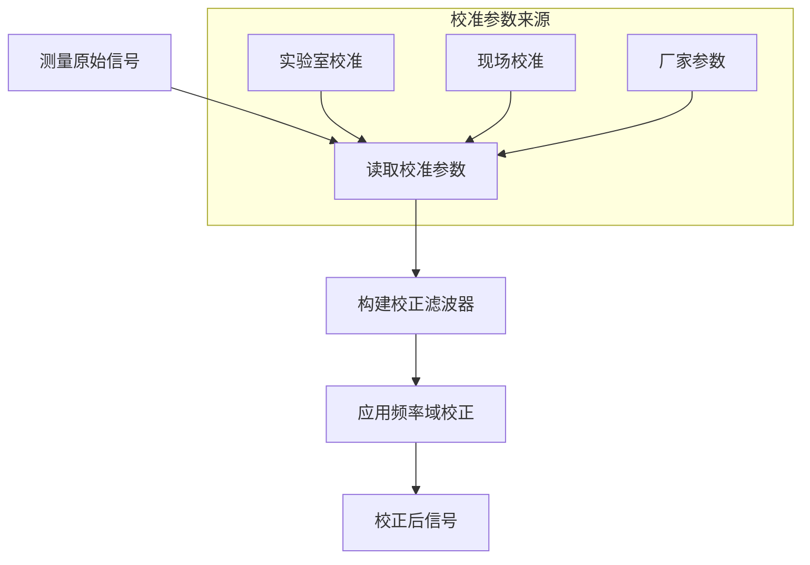

# 附录 G：校准理论

本章介绍 RMTDataPro 中的系统校准理论基础。

## 校准概述

系统校准是消除仪器响应影响、获得真实地下电性信息的关键步骤。RMTDataPro 支持对电磁场传感器（电场和磁场）进行系统响应校准。

## 系统响应模型

### 仪器传递函数

仪器可建模为具有频率相关传递函数的线性系统：

$$
H_{ins}(\omega) = H_{elec}(\omega) \cdot H_{sens}(\omega)
$$

其中：
- $H_{elec}(\omega)$: 电子线路传递函数
- $H_{sens}(\omega)$: 传感器传递函数

### 校准校正

测量信号经过校准校正后：

$$
V_{corrected}(\omega) = \frac{V_{measured}(\omega)}{H_{ins}(\omega)}
$$

## 校准参数

### 电场校准

| 参数 | 说明 | 单位 |
|------|------|------|
| **灵敏度** | 传感器电压转换系数 | V/(mV/km/s) |
| **相位偏移** | 传感器相位响应 | rad |
| **频率响应** | 幅度频率特性 | dB |

### 磁场校准

| 参数 | 说明 | 单位 |
|------|------|------|
| **线圈常数** | 感应电压与磁场比值 | V/(nT·Hz) |
| **谐振频率** | 传感器谐振点 | Hz |
| **品质因子 Q** | 谐振峰锐度 | - |

## 校准流程



## 校准文件格式

校准参数存储在 `.cal` 文件中：

```json
{
    "version": "1.0",
    "channel": "Ex",
    "serialNumber": "ABC123",
    "calibrationDate": "2026-01-15",
    "frequency": [1.0, 2.0, 5.0, 10.0],
    "amplitude": [1.002, 0.998, 1.005, 0.990],
    "phase": [0.01, -0.02, 0.05, -0.03]
}
```

## 校准质量控制

### 检查点

1. **校准日期有效性**: 确认校准未过期
2. **频率覆盖**: 校准曲线覆盖工作频段
3. **幅度一致性**: 各通道灵敏度在合理范围内
4. **相位连续性**: 相位响应无突变

### 误差估计

$$
\sigma_{cal} = \sqrt{\sigma_{meas}^2 + \sigma_{ref}^2}
$$

其中 $\sigma_{meas}$ 为测量误差，$\sigma_{ref}$ 为参考值误差。

---

**返回**: [附录索引](../index)