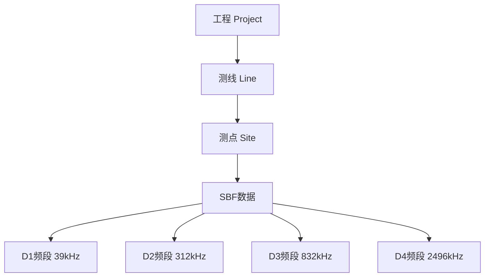
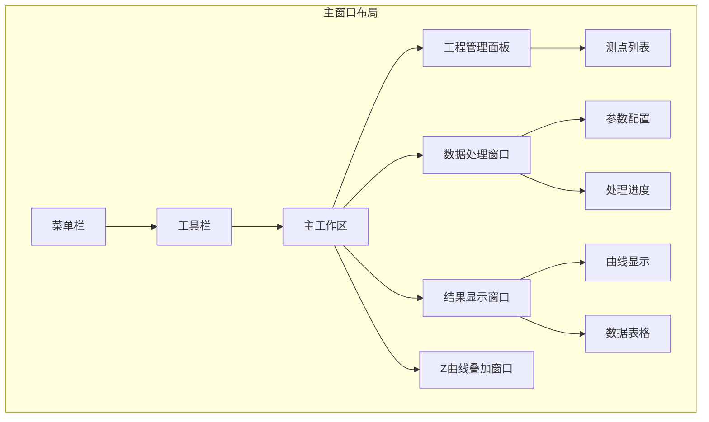

# 软件概述

本章介绍 RMTDataPro 的整体架构、数据流程和界面布局。

## 📡 RMT 与 MT 处理差异

RMT（射频大地电磁法）与传统 MT（大地电磁法）在数据处理流程上有本质区别：

| 处理阶段 | MTDataPro | RMTDataPro |
|----------|-----------|------------|
| **原始数据** | 时间序列（Ex, Ey, Hx, Hy, Hz） | 频谱数据（已预计算） |
| **FFT 处理** | 需要配置窗口、重叠等参数 | 不需要（已预先计算） |
| **数据格式** | AGE、SEG-D、miniSEED | SBF（Station Binary Format） |
| **处理目标** | 时间序列 → 阻抗 | 频谱 → 传输函数 → 阻抗 |
| **计算量** | 大（完整 FFT） | 小（直接估计） |

> **核心区别**: MTDataPro 处理原始时间序列数据，需要配置完整的 FFT 参数；而 RMTDataPro 处理的是已经过预处理的频谱数据，主要进行阻抗估计和后处理。

## 🏗️ 数据层级结构

RMTDataPro 采用层级化的数据组织方式：

### 工程（Project）

- 最高层级数据容器
- 包含全局参数和所有测线
- 支持工程保存与加载（.rmtproj 格式）

### 测线（Line）

- 同一测线上的测点集合
- 便于批量操作和线号管理
- 支持测线重命名、排序

### 测点（Site）

- 独立的数据采集站
- 包含多个 SBF 文件和频段数据
- 支持单点处理和多点批处理

## 📂 SBF 数据格式

SBF（Station Binary Format）是一种二进制数据格式，包含以下频段：

| 频段 | 采样率 | 中心频率 | 应用场景 |
|------|--------|----------|----------|
| **D1** | 39 kHz | - | 深部探测 |
| **D2** | 312 kHz | - | 中等深度 |
| **D3** | 832 kHz | - | 浅部探测 |
| **D4** | 2496 kHz | - | 极浅部/近地表 |

SBF 文件结构包含多个数据段（Section）：

- **Text Section**: 文本注释信息
- **Ini Section**: 初始化参数
- **Trass Section**: 时间序列数据
- **Spectrum Section**: 频谱数据
- **Device Parameter**: 设备参数
- **Registrar Parameter**: 注册参数

## 🖥️ 界面布局

RMTDataPro 主界面采用多面板布局：

### 菜单栏

| 菜单 | 功能 |
|------|------|
| **项目** | 新建、打开、保存、关闭工程；批量导出 |
| **工具** | About 关于 |
| **设置** | FFT参数、校准、样式设置、图表系列设置、语言 |

### 主要面板

1. **工程管理面板**: 左侧，层级显示测线/测点
2. **数据处理窗口**: 右侧，处理参数配置与执行
3. **结果显示窗口**: 下方/右侧，ρ-φ 曲线与数据表格
4. **Z曲线叠加窗口**: 独立标签页，多测点对比

## ⚡ 数据处理流程

### 处理步骤详解

1. **数据加载**: 读取 SBF 文件，解析各频段数据
2. **参数配置**: 设置窗口长度、重叠、目标频点
3. **频段处理**: 按采样率分别处理 D1-D4 频段
4. **阻抗估计**: 使用 Gamble 方法计算张量/标量阻抗
5. **结果输出**: 显示曲线，导出为 EDI 或文本格式

## 🔧 核心模块

| 模块 | 路径 | 功能 |
|------|------|------|
| 主窗口 | `RMTDataPro.h/cpp` | 应用主界面、菜单响应 |
| 项目管理 | `ProjectManage/` | 工程、测线、测点数据模型 |
| SBF读取器 | `DataReader/SBF/` | SBF 格式解析与加载 |
| FFT处理器 | `Processor/rmtprocessor.h/cpp` | 频谱处理与阻抗估计 |
| 校准管理 | `Calibration/` | 系统响应校准 |
| UI组件 | `UI/` | 处理窗口、结果显示、Z曲线叠加 |

## 📊 版本信息

| 组件 | 版本 |
|------|------|
| RMTDataPro | v0.1.0 |
| Qt | 6.9+ |
| Intel MKL | 2024.2+ |

---

**下一节**: [SBF 数据格式](chapter2)
