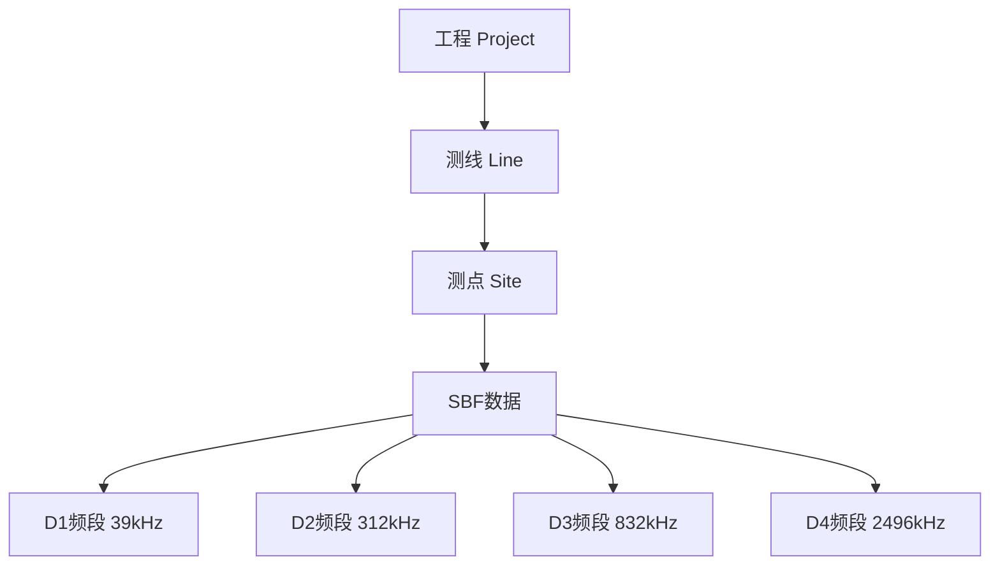
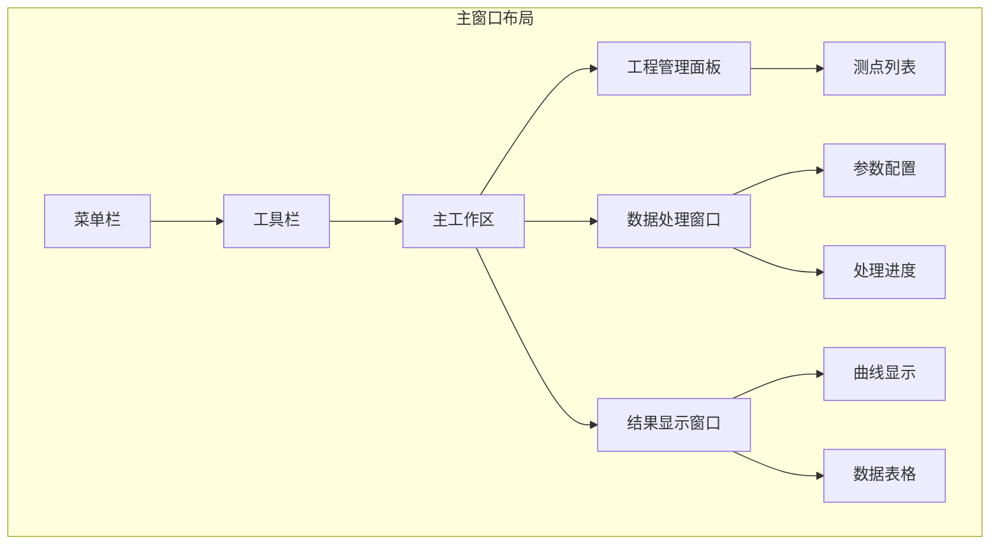

# 软件概述

本章介绍 RMTDataPro 的整体架构和操作流程。

## 操作流程

RMTDataPro 采用简洁的五步操作流程：

### 各步骤详解

| 步骤 | 名称 | 说明 |
|------|------|------|
| 1 | **数据导入** | 将 SBF 格式的频谱数据导入工程 |
| 2 | **标定管理** | 加载和管理系统校准参数 |
| 3 | **FFT参数配置** | 设置窗口参数、阻抗估计类型等 |
| 4 | **FFT处理** | 执行频谱分析，输出阻抗数据 |
| 5 | **结果导出** | 将处理结果导出为标准格式 |

## 🏗️ 数据层级结构

RMTDataPro 采用层级化的数据组织方式：

### 工程（Project）

- 最高层级数据容器
- 包含全局参数和所有测线
- 支持工程保存与加载（.rmtproj 格式）

### 测线（Line）

- 同一测线上的测点集合
- 便于批量操作和线号管理
- 支持测线重命名、排序

### 测点（Site）

- 独立的数据采集站
- 包含多个 SBF 文件和频段数据
- 支持单点处理和多点批处理

## 📂 数据导入

### 支持的数据格式

RMTDataPro 支持 SBF（Station Binary Format）格式的频谱数据文件导入：

| 频段 | 采样率 | 频率范围 | 典型应用 |
|------|--------|----------|----------|
| **D1** | 39 kHz | ~19.5 kHz | 深部探测 |
| **D2** | 312 kHz | ~156 kHz | 中等深度 |
| **D3** | 832 kHz | ~416 kHz | 浅部勘探 |
| **D4** | 2496 kHz | ~1248 kHz | 近地表/工程探测 |

### 导入步骤

1. **新建工程**: 选择"项目"菜单 → "新建工程"
2. **创建测线**: 在工程管理面板右键 → "新建测线"
3. **导入数据**: 右键测线/测点 → "导入SBF文件"
4. **选择文件**: 在文件对话框中选择要导入的 SBF 文件
5. **确认频段**: 软件自动识别频段，可手动选择目标频段

> **提示**: 支持批量导入多个 SBF 文件，可按住 Ctrl 键多选。

## 🔧 标定管理

### 校准功能

系统校准是确保数据质量的关键步骤。RMTDataPro 提供完善的校准管理功能：

- **校准参数加载**: 自动加载系统校准文件
- **校准验证**: 检查校准文件的有效期和完整性
- **校准应用**: 处理时自动应用校准参数

### 校准流程

1. 选择 **设置** → **校准管理**
2. 选择对应的校准文件
3. 验证校准参数
4. 确认应用到后续处理

## ⚙️ FFT 参数配置

### 配置内容

通过 **设置** → **FFT参数** 菜单打开配置对话框：

| 参数 | 说明 | 推荐值 |
|------|------|--------|
| **窗口长度** | FFT 窗口的点数 | 512-1024 |
| **重叠率** | 窗口重叠比例 | 0.5-0.75 |
| **窗口模式** | 单窗口/多窗口分析 | 多窗口（MTSM） |
| **阻抗类型** | 标量/张量阻抗 | 标量阻抗 |

### 阻抗类型选择

| 类型 | 适用场景 | 优点 |
|------|----------|------|
| **标量阻抗** | 电性结构均匀、二维特征不明显 | 计算简单、抗干扰能力强 |
| **张量阻抗** | 存在明显二维/三维电性特征 | 可揭示地电结构走向特征 |

## 📊 FFT 处理

### 处理步骤

1. **选择测点**: 在工程管理面板选择要处理的测点
2. **选择频段**: 勾选要处理的频段（D1-D4）
3. **执行处理**: 点击"开始处理"按钮
4. **监控进度**: 观察处理进度和状态
5. **查看结果**: 处理完成后自动显示 ρ-φ 曲线

### 质量评估

处理结果通过相干度（γ²）评估质量：

| 相干度 γ² | 数据质量 | 是否可用 |
|-----------|----------|----------|
| > 0.8 | 优质 | ✅ 可用于解释 |
| 0.5 - 0.8 | 良好 | ✅ 可用 |
| 0.3 - 0.5 | 一般 | ⚠️ 谨慎使用 |
| < 0.3 | 较差 | ❌ 不建议使用 |

## 📤 结果导出

### 导出格式

- **EDI 格式**: 标准 MT 数据交换格式
- **文本格式**: CSV/TXT 格式，便于第三方软件读取
- **图片格式**: PNG/JPG 格式的 ρ-φ 曲线图

### 批量导出

支持多测点批量导出：

1. 选择 **项目** → **批量导出**
2. 选择要导出的测点
3. 设置导出格式和目录
4. 点击"导出"开始批量处理

## 🖥️ 界面布局

### 菜单栏

| 菜单 | 功能 |
|------|------|
| **项目** | 新建、打开、保存、关闭工程；批量导出 |
| **工具** | About 关于 |
| **设置** | FFT参数、校准、样式设置、语言 |

---

**下一节**: [FFT 参数配置与处理](chapter3)
