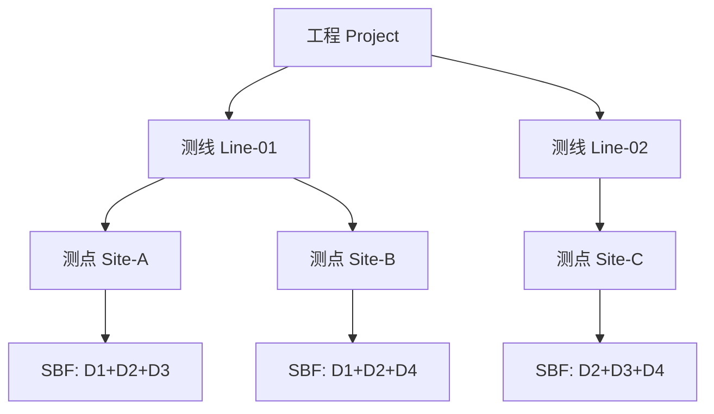

# 数据导入

本章详细介绍如何将 SBF 格式的频谱数据导入 RMTDataPro 工程。

## 📂 SBF 文件导入

### 导入方式

RMTDataPro 提供两种数据导入方式：

#### 方式一：通过菜单导入

1. 选择 **项目** → **新建工程**（或打开已有工程）
2. 在工程管理面板中，选中目标测线
3. 右键点击 → **导入 SBF 文件**
4. 在文件对话框中选择要导入的 SBF 文件
5. 点击"打开"确认导入

#### 方式二：通过拖拽导入

1. 打开工程并选中目标测线
2. 直接将 SBF 文件拖拽到工程管理面板
3. 软件自动识别并导入文件

### 支持的频段

SBF 数据包含四个频段，不同频段适用于不同的探测深度：

| 频段 | 采样率 | 频率范围 | 典型应用 |
|------|--------|----------|----------|
| **D1** | 39 kHz | ~19.5 kHz | 深部地质探测 |
| **D2** | 312 kHz | ~156 kHz | 中等深度 |
| **D3** | 832 kHz | ~416 kHz | 浅部勘探 |
| **D4** | 2496 kHz | ~1248 kHz | 近地表/工程探测 |

> **注意**: D4 频段在 M 模式下为 2496 kHz，在 L 模式下为 1248 kHz。

### 导入后检查

导入完成后，在测点下会显示对应的频段数据：

- ✅ D1 - 39kHz
- ✅ D2 - 312kHz  
- ✅ D3 - 832kHz
- ✅ D4 - 2496kHz

如果某个频段显示为 ❌ 或缺失，说明该 SBF 文件不包含该频段数据。

## 🗂️ 工程管理

### 创建测线

1. 在工程管理面板中右键点击工程节点
2. 选择 **新建测线**
3. 输入测线名称
4. 测线创建完成

### 创建测点

1. 右键点击测线节点
2. 选择 **新建测点**
3. 输入测点名称
4. 测点创建完成，可以导入 SBF 数据

### 组织结构

## ❓ 常见问题

| 问题 | 原因 | 解决方法 |
|------|------|----------|
| 无法导入文件 | 文件格式不正确或损坏 | 确认文件为 SBF 格式，验证完整性 |
| 频段显示缺失 | 采集时未启用该频段 | 检查设备配置或使用其他 SBF 文件 |
| 拖拽导入无效 | 未选中测线节点 | 先选中目标测线，再拖拽文件 |
| 导入速度慢 | 文件过大或数量过多 | 等待或分批导入 |

---

**下一节**: [FFT 参数配置与处理](chapter3)
