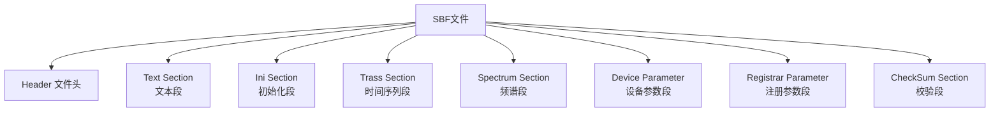
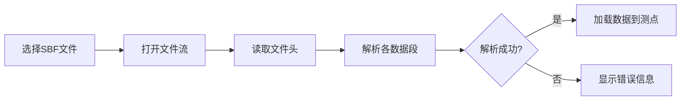
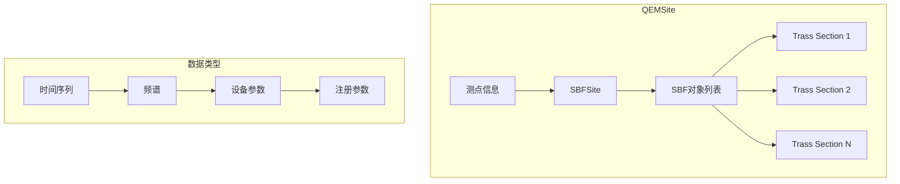

# SBF 数据格式

本章详细介绍 SBF（Station Binary Format）数据格式的结构和使用方法。

## 📋 SBF 格式概述

SBF 是一种二进制数据格式，用于存储 RMT 采集站的频谱和辅助数据。与原始时间序列不同，SBF 已经过预处理，包含了频域数据。

### 主要特点

- **二进制格式**: 紧凑，读取速度快
- **多频段支持**: D1、D2、D3、D4 同时存储
- **自描述性**: 包含头部信息和参数
- **校验机制**: 内置校验和验证

## 🏗️ SBF 文件结构

SBF 文件由多个数据段（Section）组成，每个段有不同的功能和格式：



### 各段说明

| Section | 类型 | 说明 |
|---------|------|------|
| **Text** | 文本 | 注释、测点信息 |
| **Ini** | 参数 | 初始化参数配置 |
| **Trass** | 时间序列 | 原始时间序列数据 |
| **Spectrum** | 频谱 | 预计算的频谱数据 |
| **Device Parameter** | 参数 | 采集设备参数 |
| **Registrar Parameter** | 参数 | 注册相关参数 |
| **CheckSum** | 校验 | 数据完整性校验 |

## 📡 频段（D1-D4）

SBF 支持四个频段，每个频段对应不同的采样率和频率范围：

| 频段 | 采样率 | 频率范围 | 典型应用 |
|------|--------|----------|----------|
| **D1** | 39 kHz | ~19.5 kHz | 深部地质探测 |
| **D2** | 312 kHz | ~156 kHz | 中等深度 |
| **D3** | 832 kHz | ~416 kHz | 浅部勘探 |
| **D4** | 2496 kHz | ~1248 kHz | 近地表/工程探测 |

> **注意**: D4 频段在 M 模式下为 2496 kHz，在 L 模式下为 1248 kHz。

### 频段采样率常量

```cpp
// SBFBandsSampleRate 数组定义
const double SBFBandsSampleRate[] = { 39000, 312000, 832000, 2496000 };
const QString SBFBandsName[] = { "D1", "D2", "D3", "D4" };
```

## 🔄 SBF 文件加载

### 基本加载流程



### 代码示例

```cpp
// 创建 SBFSite 对象
SBFSite* site = new SBFSite();

// 加载 SBF 文件
bool success = site->load("path/to/data.sbf");

if (success) {
    // 获取加载的 SBF 对象数量
    int count = site->sbfTrassCount();
    
    // 获取特定频段的时间序列数据
    MultiChannelTimeSeries* ts = site->getTSData(SBFBands::D1);
}
```

## 🔍 SBF 数据访问

### 获取 SBF 对象

```cpp
// 获取所有 Trass Section
for (int i = 0; i < site->sbfTrassCount(); ++i) {
    SBFTrassSection* trass = site->getSBFTrass(i);
    // 处理时间序列数据
}

// 获取注册参数
SBFRegistrarParameterSection* regParam = site->registrarParameterSection();
```

### 获取时间序列数据

```cpp
// 按频段获取时间序列
MultiChannelTimeSeries* d1Data = site->getTSData(SBFBands::D1);
MultiChannelTimeSeries* d2Data = site->getTSData(SBFBands::D2);
MultiChannelTimeSeries* d3Data = site->getTSData(SBFBands::D3);
MultiChannelTimeSeries* d4Data = site->getTSData(SBFBands::D4);
```

## 🗂️ 多 SBF 文件管理

一个测点可以包含多个 SBF 文件，这在长时间采集或多次采集时很常见：

```cpp
// 添加额外的 SBF 文件到现有测点
site->addSBF("path/to/additional_file.sbf");

// 删除特定 SBF 文件
site->deleteSBFTrass(index);

// 清除所有 SBF 数据
site->clear();
```

## 🔗 SBF 与测点数据模型



## ⚙️ SBF 版本

SBF 格式有不同的版本，通过 `SBFVersion` 枚举标识：

| 版本 | 说明 |
|------|------|
| `Version1` | 初始版本 |
| `Version2` | 增加新字段 |
| `Version3` | 最新版本 |

版本信息用于兼容处理和数据解析：

```cpp
site->setVersion(SBFVersion::Version3);
SBFVersion ver = site->version();
```

## 📤 SBF 数据导出

SBF 数据可以保存为文件：

```cpp
// 保存 SBF 数据到文件
site->save("path/to/output.sbf");
```

## ❓ 常见问题

| 问题 | 原因 | 解决方法 |
|------|------|----------|
| 加载失败 | 文件损坏 | 验证文件完整性 |
| 频段缺失 | 采集时未启用 | 检查设备配置 |
| 数据异常 | 采样率不匹配 | 确认频段设置 |
| 版本不兼容 | SBF 版本过旧 | 更新软件版本 |

---

**下一节**: [FFT 处理](chapter3)
