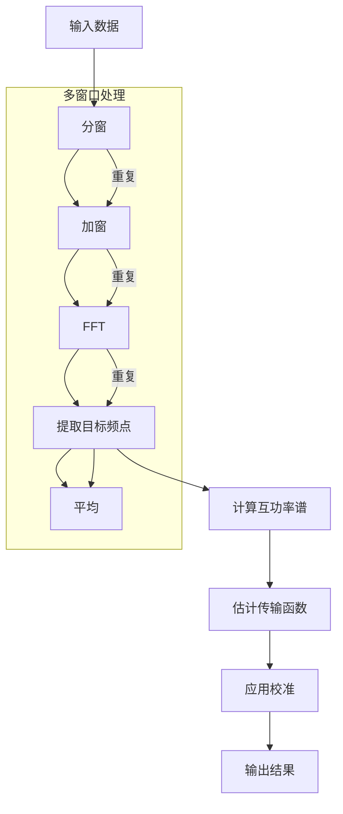

# FFT 处理

本章详细介绍 RMTDataPro 中的 FFT 处理功能和参数配置。

## ⚙️ FFT 参数配置

FFT 参数是影响处理质量的关键配置。通过 **设置 → FFT 参数** 菜单打开配置对话框。

### 基础参数

| 参数 | 说明 | 取值范围 | 默认值 |
|------|------|----------|--------|
| **窗口长度** | FFT 窗口的点数 | 128-4096 | 512 |
| **重叠率** | 窗口重叠比例 | 0.0-0.95 | 0.5 |
| **窗口模式** | 单窗口/多窗口分析 | - | 多窗口 |
| **窗口类型** | 窗函数类型 | Hamming/Hanning/Kaiser 等 | Hanning |

### 时窗长度

时窗长度决定了频率分辨率：

```
频率分辨率 = 采样率 / 窗口长度
```

| 采样率 | 窗口长度 | 频率分辨率 |
|--------|----------|------------|
| 39 kHz | 512 | 76.2 Hz |
| 39 kHz | 1024 | 38.1 Hz |
| 312 kHz | 512 | 609.4 Hz |

### 重叠率

重叠率影响统计稳定性：

- **低重叠率 (0.25-0.5)**: 计算快，统计样本少
- **中等重叠率 (0.5-0.75)**: 平衡速度和稳定性
- **高重叠率 (0.75-0.9)**: 统计样本多，计算慢

## 🪟 窗口模式

### 单窗口模式

使用单个窗口进行 FFT 分析，适用于数据量较少或噪声较低的情况。

```cpp
// 设置为单窗口模式
param.setWindowMode(FFT::WindowMode::Single);
param.setSingleWindowType(FFT::WindowType::Hanning);
```

### 多窗口模式（MTSM）

多窗口谱分析（Multiple Taper Spectral Method）使用多个正交窗口（锥度）来减少频谱泄漏：

```cpp
// 设置为多窗口模式
param.setWindowMode(FFT::WindowMode::Multiple);

// 时间带宽积（NW）
param.setTimeBandwidthProduct(2.0);

// 窗口数量（K）
param.setNumWindows(3);
```

**推荐配置**:

| NW | K | 频率分辨率 | 统计稳定性 |
|----|---|------------|------------|
| 2.0 | 3 | 中等 | 良好 |
| 2.5 | 4 | 较高 | 很好 |
| 3.0 | 5 | 高 | 优秀 |

### MTSM 数学原理

多窗口谱分析（Multiple Taper Spectral Method, MTSM）使用多个正交窗函数（锥度）来减少频谱泄漏，提高谱估计的统计稳定性。

#### 离散球面调和函数（DPSS）

MTSM 使用离散球面调和函数（Discrete Prolate Spheroidal Sequences, DPSS）作为窗函数：

$$
w_k(n) = \frac{1}{\sqrt{\sum_{n=0}^{N-1} w_k(n)^2}} \sum_{m=-k}^{k} d_{km} e^{i 2\pi m n / N}
$$

其中 $k = 0, 1, \ldots, K-1$ 为窗口索引，$K$ 为窗口数量。

#### 多窗口功率谱估计

$$
S_{xx}^{(MTSM)}(f) = \frac{1}{K} \sum_{k=0}^{K-1} S_{xx}^{(k)}(f)
$$

其中 $S_{xx}^{(k)}(f)$ 是使用第 $k$ 个锥度计算的功率谱：

$$
S_{xx}^{(k)}(f) = X_k(f) X_k^*(f)
$$

#### 统计特性

MTSM 的优势在于：
- **减少频谱泄漏**: 正交窗函数的叠加效应
- **提高自由度**: 有效自由度为 $2K$
- **偏差-方差权衡**: 通过时间带宽积 $W \cdot N$ 控制


**参数选择原则**:

| 时间带宽积 NW | 窗口数 K | 频率分辨率 | 统计稳定性 |
|--------------|----------|------------|------------|
| 2.0 | 3 | 中等 | 良好 |
| 2.5 | 4 | 较高 | 很好 |
| 3.0 | 5 | 高 | 优秀 |
| 4.0 | 7 | 最高 | 最优 |

NW 与 K 的关系：$K \approx 2NW - 1$

## 📊 目标频率配置

每个频段可以设置独立的目标频率列表：

```cpp
// 配置目标频率（采样率 -> 目标频率列表）
QMap<double, QVector<double>> targetFreqs;

targetFreqs[39000.0] = {100, 200, 500, 1000};      // D1 频段
targetFreqs[312000.0] = {5000, 10000, 20000};       // D2 频段
targetFreqs[832000.0] = {50000, 100000, 200000};    // D3 频段
targetFreqs[2496000.0] = {500000, 1000000};         // D4 频段

param.setTargetFrequencies(targetFreqs);
```

### 频率带宽

```cpp
// 设置频率提取带宽（频率分辨率的倍数）
param.setBandwidth(3);  // 中心频点 ± 左右各1个bin
```

## 🔢 阻抗估计类型

### 张量阻抗

张量阻抗使用 Gamble 方法，同时利用水平和垂直磁场：

```cpp
param.setImpedanceType(RMTImpedanceType::Tensor);
```

适用场景：
- 三维地质结构
- 需要完整阻抗张量
- 极化分析

### 标量阻抗

标量阻抗只使用水平磁场分量：

```cpp
param.setImpedanceType(RMTImpedanceType::Scalar);
```

适用场景：
- 一维/二维地质结构
- 快速处理
- 噪声较大数据

## 📈 数据类型与频段启用

RMTDataPro 支持两种数据类型，每种类型有不同的频段配置：

### SBF 数据类型

SBF 数据有 4 个频段：

```cpp
param.setDataType(RMTDataType::SBF);

// 配置 SBF 频段启用状态
QVector<bool> sbfEnabled = {true, true, true, true};  // D1, D2, D3, D4
param.setSbfBandEnabled(sbfEnabled);
```

### TR 数据类型

TR 数据有 3 个频段（不同的采样率配置）：

```cpp
param.setDataType(RMTDataType::TR);

// 配置 TR 频段启用状态
QVector<bool> trEnabled = {true, true, true};  // 3个频段
param.setTrBandEnabled(trEnabled);
```

## 🔧 处理流程



## 📋 参数配置示例

### 标准配置（推荐）

```json
{
    "windowLength": 512,
    "overlap": 0.5,
    "windowMode": "Multiple",
    "timeBandwidthProduct": 2.0,
    "numWindows": 3,
    "bandwidth": 3,
    "impedanceType": "Tensor",
    "averageType": "WeightedMean"
}
```

### 快速处理配置

```json
{
    "windowLength": 256,
    "overlap": 0.25,
    "windowMode": "Single",
    "singleWindowType": "Hanning",
    "bandwidth": 1,
    "impedanceType": "Scalar"
}
```

## 💾 参数文件

FFT 参数可以保存为 JSON 文件：

```cpp
// 保存参数到文件
param.saveToJson("fft_params.json");

// 从文件加载参数
RMTFFTParam loadedParam;
loadedParam.loadFromJson("fft_params.json");
```

---

**下一节**: [数据处理](chapter4)
