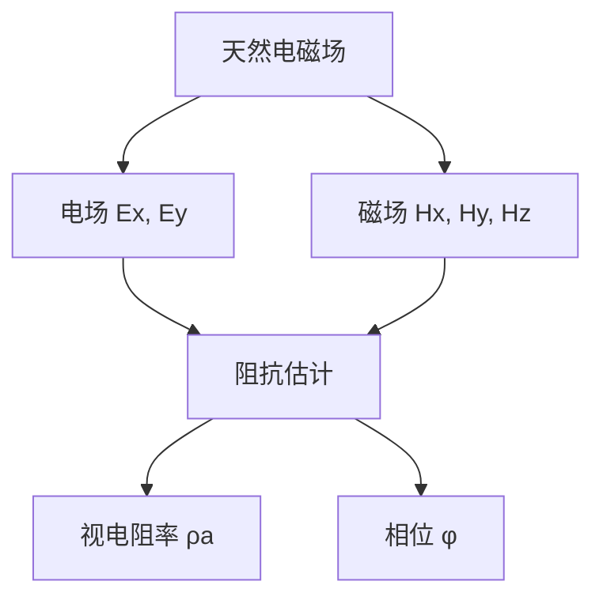
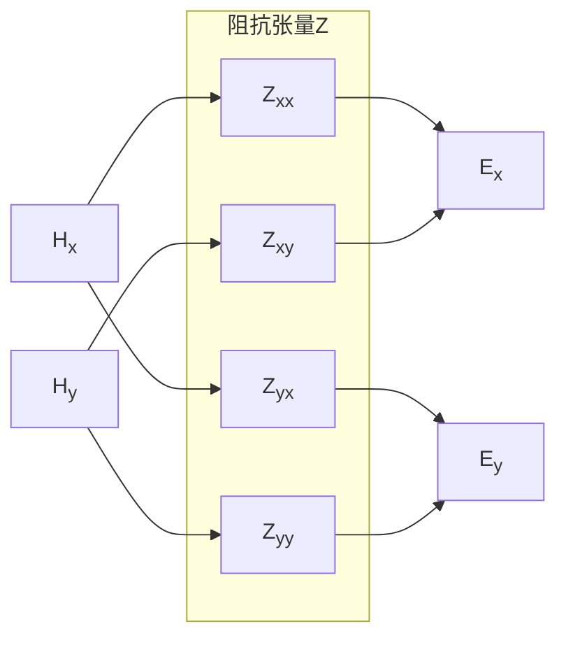
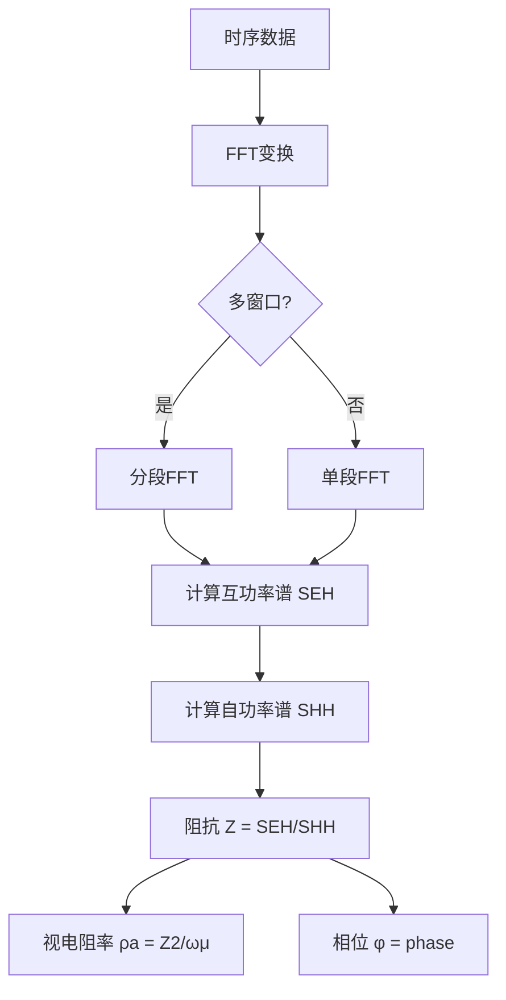
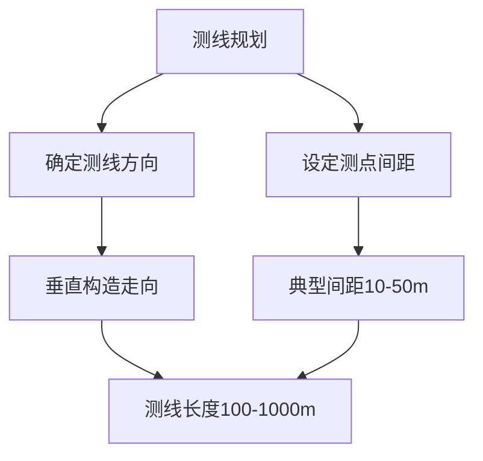
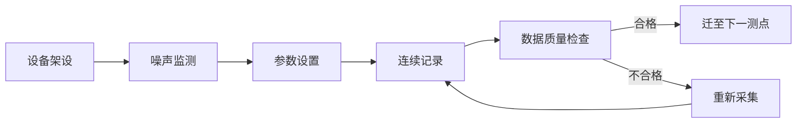
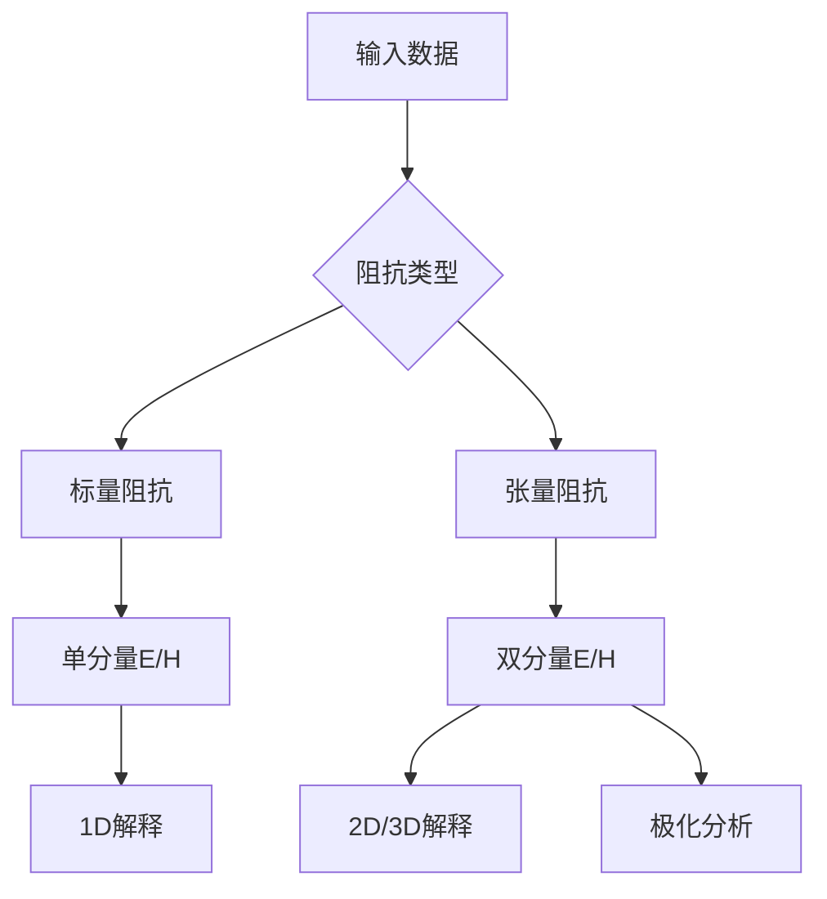

# RMT 原理

本章介绍射频大地电磁法（RMT）的基本原理，包括电磁场理论基础、阻抗计算方法和频率-深度关系。

## RMT 方法概述

RMT（射频大地电磁法，Radio Magnetotellurics）是一种被动源电磁探测技术，通过采集高频段（1 kHz – 1 MHz）的天然电磁场信号来研究浅层地下电性结构。

### 技术参数

| 参数 | 数值 | 说明 |
|------|------|------|
| **频率范围** | 1 kHz – 1 MHz | 典型工作频段 10-250 kHz |
| **探测深度** | 0-100 米 | 取决于频率和地层电阻率 |
| **信号来源** | 天然电磁场 | VLF发射台、无线电、电力线 |
| **分辨率** | 高 | 适用于浅层目标探测 |

### 基本原理

RMT 方法基于以下物理原理：

1. **天然电磁场**: 地球天然存在宽频带的电磁场信号
2. **趋肤效应**: 高频信号主要反映浅层电性结构
3. **阻抗响应**: 地下电性结构对电磁场的响应可用阻抗表征

### RMT 方法流程图



## 电磁场理论基础

Maxwell方程组是电磁场理论的基石，描述了电场、磁场与电荷、电流之间的基本关系。在RMT应用中，我们关注的是频率域电磁场，因此采用时变场的微分形式。

### Maxwell方程组（微分形式）

- **法拉第电磁感应定律**：
  $$\nabla \times \mathbf{E} = -\frac{\partial \mathbf{B}}{\partial t}$$

- **安培环路定律（含位移电流）**：
  $$\nabla \times \mathbf{H} = \mathbf{J} + \frac{\partial \mathbf{D}}{\partial t}$$

- **高斯定律（电场）**：
  $$\nabla \cdot \mathbf{D} = \rho$$

- **高斯定律（磁场）**：
  $$\nabla \cdot \mathbf{B} = 0$$

其中 $\mathbf{E}$ 为电场强度，$\mathbf{H}$ 为磁场强度，$\mathbf{D}$ 为电位移矢量，$\mathbf{B}$ 为磁感应强度，$\mathbf{J}$ 为电流密度，$\rho$ 为电荷密度。

### 本构关系

介质特性通过本构关系描述：

$$\mathbf{D} = \varepsilon \mathbf{E}, \quad \mathbf{B} = \mu \mathbf{H}, \quad \mathbf{J} = \sigma \mathbf{E}$$

其中 $\varepsilon$ 为介电常数，$\mu$ 为磁导率，$\sigma$ 为电导率，$\rho = 1/\sigma$ 为电阻率。

### 平面波近似与波阻抗

在远场区域（距离源的距离远大于波长），电磁波可近似为平面波。从Maxwell方程组可推导Helmholtz方程：

$$\nabla^2 \mathbf{E} + k^2 \mathbf{E} = 0, \quad k^2 = \omega^2 \mu \varepsilon$$

平面波的E、H分量满足波阻抗关系：

$$Z = \frac{E}{H} = \sqrt{\frac{i\omega\mu}{\sigma}} = \sqrt{i\omega\mu\rho}$$


### 视电阻率定义

基于波阻抗，RMT中的视电阻率定义为：

$$\rho_a = \frac{1}{\omega\mu} |Z|^2$$

相位则为阻抗的相位角：

$$\phi = \arg(Z)$$

## 平面波近似与阻抗张量

### 平面波近似条件

RMT 信号频率范围为 1 kHz – 1 MHz，在空气中的波长为：

$$
\lambda = \frac{c}{f} = \frac{3 \times 10^8 \text{ m/s}}{f}
$$

计算可得波长范围为 300 km（1 kHz）至 300 m（1 MHz）。在典型探测深度（0-100 m）条件下，电磁波波前可视为平面波。当源-接收距 >> 趋肤深度时，平面波近似成立。

### 阻抗张量定义

在三维情况下，电场和磁场通过阻抗张量 $\mathbf{Z}$ 相关联：

$$
\begin{bmatrix} E_x \\ E_y \end{bmatrix} = \begin{bmatrix} Z_{xx} & Z_{xy} \\ Z_{yx} & Z_{yy} \end{bmatrix} \begin{bmatrix} H_x \\ H_y \end{bmatrix}
$$

其中 $Z_{ij}$ 表示磁场分量 $H_j$ 到电场分量 $E_i$ 的传递函数。



### 不同维度地球的阻抗特征

| 地球类型 | Zxx | Zyy | Zxy | Zyx |
|----------|-----|-----|-----|-----|
| 1D 水平层状 | 0 | 0 | ≠0 | ≠0 且 $Z_{xy} = -Z_{yx}$ |
| 2D | 0 | 0 | ≠0 | 0 或 $Z_{xy} = 0$ |
| 3D | ≠0 | ≠0 | ≠0 | ≠0 |

### 阻抗性质

- **反对称性**：在一维情况下，$Z_{xy} = -Z_{yx}$
- **相位响应**：$\varphi = \arg(Z_{xy})$ 表示电场相对于磁场的相位延迟

## Gamble 方法

Gamble方法由Gamble等人在1970年代提出，是一种用于大地电磁测深数据处理的重要阻抗估计方法。该方法通过电场和磁场的时间序列计算互功率谱，从而获得阻抗张量。当采用标量阻抗近似时，阻抗可表示为 $Z = E_x / H_y$ 或 $Z = E_y / H_x$。

### 互功率谱方法

对于标量阻抗估计，互功率谱和自功率谱的计算公式为：

$$
S_{EH}(f) = E(f) \cdot H^*(f) \quad \text{（互功率谱）}
$$

$$
S_{HH}(f) = H(f) \cdot H^*(f) \quad \text{（自功率谱）}
$$

其中 $E(f)$ 和 $H(f)$ 分别为电场和磁场的傅里叶变换，$H^*$ 表示复共轭。阻抗估计值为：

$$
Z_{EH}(f) = \frac{S_{EH}(f)}{S_{HH}(f)}
$$

### Gamble算法流程



### 统计稳定性

使用多窗口分段方法（MTSM）可获得更好的统计稳定性。相干度用于评估信号质量：

$$
\gamma^2 = \frac{|S_{EH}|^2}{S_{EE} \cdot S_{HH}}
$$

典型良好相干度要求 $\gamma^2 > 0.5$。

## 频率-深度关系

电磁场在地层中的传播遵循趋肤效应（Skin Effect）原理。趋肤深度是描述电磁场衰减特征的核心参数。

### 趋肤深度定义

趋肤深度 $\delta$ 定义为电磁场振幅衰减至表面值 $1/e$（约37%）所对应的深度：

$$\delta = \sqrt{\frac{2\rho}{\omega\mu}} = \sqrt{\frac{\rho}{\pi f \mu}}$$

其中：
- $\rho$ 为地层电阻率（$\Omega \cdot m$）
- $\omega = 2\pi f$ 为角频率
- $f$ 为频率（Hz）
- $\mu \approx \mu_0 = 4\pi \times 10^{-7}$ H/m 为磁导率（非磁性岩石）

### 数值算例

**例1**：电阻率 $\rho = 100\ \Omega \cdot m$，频率 $f = 10$ kHz

$$\delta = \frac{\sqrt{100}}{\sqrt{\pi \times 10000 \times 4\pi \times 10^{-7}}} \approx \frac{10}{0.316} \approx 31.6\ m$$

**例2**：电阻率 $\rho = 1000\ \Omega \cdot m$，频率 $f = 100$ kHz

$$\delta = \sqrt{\frac{1000}{\pi \times 100000 \times 4\pi \times 10^{-7}}} \approx 50\ m$$

### 频率-深度对照表

RMT典型工作频段（1-1000 kHz）对应的探测深度范围：

| 频率 (kHz) | 深度范围 (m, ρ=100 Ω·m) | 深度范围 (m, ρ=1000 Ω·m) |
|------------|-------------------------|--------------------------|
| 1          | 50-160                  | 160-500                  |
| 10         | 16-50                   | 50-160                   |
| 100        | 5-16                    | 16-50                    |
| 1000       | 1.6-5                   | 5-16                     |

### 深度分辨率

垂直分辨率定义为 $\delta / \sqrt{2}$（Rayleigh准则）：
- 高频：穿透深度浅，分辨率高
- 低频：穿透深度深，分辨率低

### RMT典型深度范围

RMT方法在典型地电条件下可探测0-100 m深度的地下电性结构。在高电阻率地区（如干燥基岩），最大探测深度可达200-300 m。

## 野外施工

### 测线布置与测点选址

RMT野外施工前需要进行详细的测线布置和测点选址：

**选址原则**：
- **电磁干扰小**: 远离电力线、变压器、无线电发射塔等干扰源（>500 m）
- **地形平坦**: 避开山谷、悬崖等剧烈地形变化区域
- **接地条件好**: 土壤潮湿、电阻率适中的区域有利于电极接地
- **access便利**: 便于设备运输和数据采集

**测线布置**：


**测点标记**：
- 使用GPS记录每个测点的精确坐标
- 测点间距根据探测目标和地形条件调整
- 困难地形可适当增加间距

### 设备安装

RMT测量使用两套传感器：电场电极和磁场感应线圈。

**电场测量（E分量）**：
```
设备: Ag/AgCl不极化电极
布置: 沿测线方向水平放置
极距: 常见50-100 m
接地电阻: 应<10 kΩ
```

- 电极埋入潮湿土壤约10-20 cm
- 保持电极极化稳定
- 连接低噪声同轴电缆至采集主机

**磁场测量（H分量）**：
```
设备: 感应线圈磁力仪
布置: 水平放置，记录Hx、Hy
方向: 磁北方向标定
位置: 距电极>5 m以避免干扰
```

- 线圈需水平定向（使用指南针）
- 远离金属物体（>10 m）
- 记录线圈方位角用于后期校正

### 数据采集流程



**采集参数设置**：
- 采样率: 根据频段选择（D1: 39 kHz, D2: 312 kHz等）
- 记录时长: 每个测点至少10-30分钟
- 触发阈值: 根据当地电磁噪声水平设置

**质量控制要点**：
1. **实时监控**: 观察电磁场时间序列的振幅和波形
2. **噪声检查**: 确保无工频干扰（50/60 Hz）和无线电信号饱和
3. **重复测量**: 关键测点进行重复测量以评估精度
4. **现场初步处理**: 快速计算视电阻率初步曲线，判断数据质量

### 特殊场地施工

**城市及干扰区**：
- 增加采集时间以提高统计平均
- 采用多窗口谱分析（MTSM）提高信噪比
- 标记严重干扰时段用于后期剔除

**山地及困难地形**：
- 适当调整测点位置，保持测线连续性
- 使用更长的极距以提高信号强度
- 注意设备防水和防潮

**潮湿地区**：
- 电极接地条件好，但需注意湿地电位稳定
- 可能存在天然电磁噪声源（如湿地铁矿）

### 数据记录与整理

**野外记录内容**：
- 测点编号、坐标（GPS）
- 采集时间、持续时长
- 天气条件、环境描述
- 设备状态、校准信息
- 异常现象及处理措施

**数据备份**：
- 每日数据及时备份
- 原始数据与处理数据分开存储
- 记录数据文件的校验和信息

## 标量阻抗与张量阻抗

### 1. 标量阻抗（Scalar Impedance）

标量阻抗是电磁场水平和垂直分量的单分量比值：

$$Z = \frac{E}{H}$$

在RMT中常用的形式为：

$$Z_x = \frac{E_x}{H_y} \quad \text{或} \quad Z_y = \frac{E_y}{H_x}$$

**适用条件**：
- 一维地电断面（水平层状介质）
- 阻抗各向同性
- 主轴方向明确的情况

### 标量阻抗处理流程

标量阻抗处理是将电场和磁场时间序列转换为视电阻率和相位的完整流程：

**处理步骤**：

```
1. 时间序列准备
   ├── 读取电场 Ex, Ey 时间序列
   ├── 读取磁场 Hx, Hy 时间序列
   └── 去除仪器响应（校准）

2. 傅里叶变换
   ├── 分窗（窗口长度 N）
   ├── 加窗（Hanning 或 DPSS）
   └── 计算 FFT 得到频域信号

3. 互功率谱计算
   ├── S_EH = <E(f) · H*(f)>  （互功率谱）
   ├── S_EE = <E(f) · E*(f)>  （自功率谱）
   └── S_HH = <H(f) · H*(f)>  （自功率谱）

4. 阻抗估计
   ├── 标量阻抗: Z = S_EH / S_HH
   ├── 视电阻率: ρa = |Z|² / (ωμ)
   └── 相位: φ = arg(Z)

5. 质量控制
   ├── 相干度: γ² = |S_EH|² / (S_EE · S_HH)
   ├── 剔除相干度低的频点
   └── 重复测量对比
```

**RMTDataPro 标量阻抗配置**：

```cpp
// 设置为标量阻抗模式
param.setImpedanceType(RMTImpedanceType::Scalar);

// 典型参数配置
param.setWindowLength(512);       // 窗口长度
param.setOverlap(0.5);            // 50%重叠
param.setTimeBandwidthProduct(2.0);  // MTSM时间带宽积
```

**处理要点**：
- **窗口选择**: 数据质量好时用Hanning，噪声大时用DPSS多窗口
- **重叠率**: 0.5-0.75 可提高统计稳定性
- **参考分量**: 标量阻抗使用 Hx(Rx) 和 Hy(Ry)，在处理器中硬编码
- **质量阈值**: 相干度 γ² > 0.5 的数据才可用于解释

**与张量阻抗的选择**：
- 标量阻抗计算简单、抗干扰能力较强
- 当探测区域存在明显二维/三维特征时，应使用张量阻抗
- 初步勘探阶段可先用标量阻抗快速筛选

### 2. 张量阻抗（Tensor Impedance）

张量阻抗为完整的 $2 \times 2$ 阻抗张量：

$$\mathbf{Z} = \begin{bmatrix} Z_{xx} & Z_{xy} \\ Z_{yx} & Z_{yy} \end{bmatrix}$$

其中每个分量均为复数，描述了电场和磁场各分量之间的线性关系。

**特点**：
- 需获取全部4个阻抗分量
- 适用于二维/三维地质构造
- 可探测非各向同性异常体
- 提供更丰富的极化信息

### 3. 对比分析



| 特性 | 标量阻抗 | 张量阻抗 |
|------|----------|----------|
| 所需分量 | 1个E, 1个H | 2个E, 2个H |
| 适用纬度 | 1D Earth | 2D/3D Earth |
| 计算复杂度 | 低 | 高 |
| 噪声敏感性 | 中等 | 较低（冗余） |
| 信息量 | 有限 | 完整 |

### 4. 适用场景

**标量阻抗适用于**：
- 一维地电断面
- 噪声较大数据
- 快速处理筛选阶段

**张量阻抗适用于**：
- 二维/三维地质构造
- 需要极化分析
- 高质量数据

### 5. RMTDataPro 实现

RMTDataPro 软件同时支持两种阻抗形式：

- **标量阻抗**：`RMTImpedanceType::Scalar`
- **张量阻抗**：`RMTImpedanceType::Tensor`

阻抗计算采用 Gamble 方法实现，支持远程牧场大地电磁数据的批量处理与分析。
