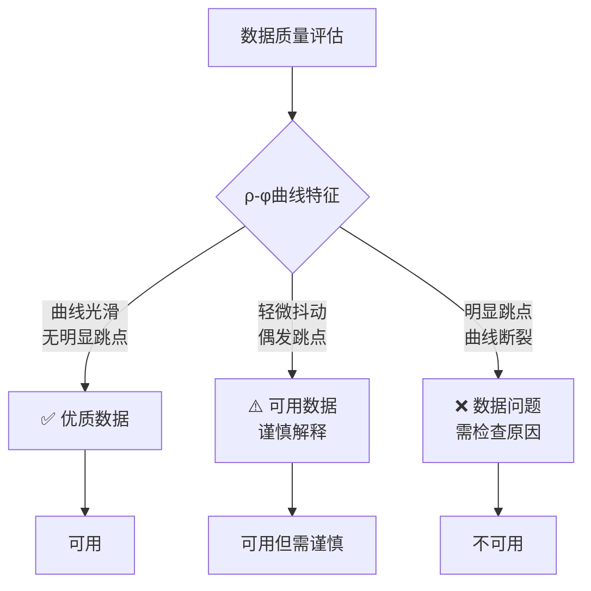

# (CS)RMT 原理简介

本章介绍可控源射频大地电磁法（(CS)RMT）的基本原理。

## 什么是 (CS)RMT？

(CS)RMT（可控源射频大地电磁法，Controlled Source Radio Magnetotellurics）是一种主动源电磁探测技术，通过人工可控源发射电磁信号来研究浅层地下电性结构。

### 与被动源 RMT 的区别

| 类型 | 信号来源 | 频率范围 | 探测深度 | 适用场景 |
|------|----------|----------|----------|----------|
| **被动源 RMT** | 天然 VLF/中波无线电 | 1 kHz – 1 MHz | ~30-100 m | 信号较强区域 |
| **主动源 (CS)RMT** | 可控人工源（电偶极子） | 1 kHz – 1000 kHz | 2-3 m ~ 100 m | 偏远区域，全频段探测 |

**为什么需要可控源？**
- 被动源 RMT 依赖远处的 VLF/无线电发射台
- 在偏远地区，低于 10 kHz 的信号无法探测，限制了探测深度
- (CS)RMT 通过人工源将低频延伸至 1 kHz，探测深度可达 ~100 m

### 技术参数

| 参数 | 数值 | 说明 |
|------|------|------|
| **频率范围** | 1 kHz – 1000 kHz | 主动源可延伸至更低频段 |
| **典型频段** | D1: 1-15 kHz, D2: 50-130 kHz, D3: 100-350 kHz, D4: 300-1000 kHz | 多频段配置 |
| **探测深度** | 2-3 m ~ 100 m | 取决于频率和地层电阻率 |
| **信号来源** | 可控人工源（水平电偶极子） | 主动发射信号 |
| **发射功率** | 0.5-1 kW | 典型功率范围 |
| **通道数** | 4 通道（2 电场 + 2 磁场 或 3 电场 + 1 磁场） | 典型配置 |

### 通道命名

本软件采用以下通道命名约定：

| 通道类型 | 本软件命名 | 说明 |
|----------|------------|------|
| 本地电场 | **Ex**, **Ey** | 水平电偶极子测量的电场 |
| 本地磁场 | **Hx**, **Hy**, **Hz** | 本地测量的磁场分量 |

> **注**：EDI 格式标准中定义的 RX、RY 通道用于远参考技术，但 (CS)RMT 作为主动源方法不采用远参考技术。

### 阻抗类型选择

根据地质结构的复杂程度，选择合适的阻抗类型：

| 阻抗类型 | 适用场景 | 说明 |
|----------|----------|------|
| **标量阻抗** | 一维水平层状结构 | 假设地下电性仅随深度变化，适用于简单层状介质 |
| **张量阻抗** | 二维/三维复杂结构 | 考虑水平方向电性变化，可揭示地电走向信息 |

对于复杂地质区域（如断裂带、破碎带发育区），应使用张量阻抗进行数据处理和解释。

---

## 视电阻率与相位 (ρ-φ)

### 核心概念

当电磁场传播到地下时，地下电性结构会对电磁场产生"阻力"，这个阻力用**阻抗 Z**表示。Cagniard (1953) 首次系统性地建立了大地电磁法的理论基础。

- **阻抗 Z** = 电场(E) / 磁场(H)

### 视电阻率公式

```{math}
:label: eq-rho-a

\rho_a = \frac{|Z|^2}{\omega\mu}
```

其中：
- $\rho_a$ = 视电阻率 (Ω·m)
- $Z = E/H$ = 阻抗
- $\omega = 2\pi f$ = 角频率
- $\mu \approx 4\pi\times 10^{-7}$ = 磁导率

**实用单位形式**：当阻抗 $Z$ 的单位为 mV/km/nT，周期 $T$ 的单位为秒时：

```{math}
:label: eq-rho-a-practical

\rho_a \approx 0.2 \cdot T \cdot |Z|^2
```

推导：$\rho_a = |Z|^2 / (\omega\mu) = |Z|^2 \cdot T / (2\pi\mu) \approx 0.2 \cdot T \cdot |Z|^2$

### 相位

相位 φ 是阻抗的"时间延迟"：

```{math}
:label: eq-phase

\varphi = \arg(Z)
```

其中 $\arg(Z)$ 表示阻抗 $Z$ 的相位角。

### 相位与地质意义

对于均匀半空间模型，相位 φ 恒等于 **45°**（与频率无关）。这是判断一维地电结构的重要标志：

- **相位 > 45°**（高频段）：表明近地表存在低阻层
- **相位 < 45°**（低频段）：表明近地表存在高阻层，或深部存在低阻层

相位偏离 45° 的程度反映了地下电性结构的复杂程度。相位曲线是地质解释的重要参考。

### ρ-φ 曲线

视电阻率和相位随频率变化的曲线称为 **ρ-φ 曲线**：

- **横轴**: 频率（高频→浅层，低频→深层）
- **左侧Y轴**: 视电阻率 ρ
- **右侧Y轴**: 相位 φ

---

## 趋肤深度与频率-深度关系

### 趋肤效应

电磁场在地下传播时会逐渐衰减。**趋肤深度**是指电磁场衰减到地表值 1/e 时的深度。

高频信号衰减快，主要反映浅层结构；低频信号衰减慢，能探测更深区域。

### 趋肤深度公式

```{math}
:label: eq-skin-depth

\delta \approx 503\sqrt{\frac{\rho}{f}}
```

其中：
- $\delta$ = 趋肤深度 (m)
- $\rho$ = 地层电阻率 (Ω·m)
- $f$ = 频率 (Hz)

> **重要说明**：趋肤深度 δ 不是探测深度。电磁场能量随深度指数衰减，50% 的信号来自深度约 **0.35δ** 以内的地层。因此，有效探测深度约为趋肤深度的 0.35 倍。

### 频率-深度对照表

| 频率 | 深度范围 (ρ=100 Ω·m) | 深度范围 (ρ=1000 Ω·m) |
|------|----------------------|------------------------|
| 1 kHz | 100-160 m | 320-500 m |
| 10 kHz | 30-50 m | 100-160 m |
| 50 kHz | 15-25 m | 45-80 m |
| 100 kHz | 10-16 m | 32-50 m |
| 250 kHz | 6-10 m | 20-32 m |
| 500 kHz | 4-6 m | 13-20 m |
| 1000 kHz | 3-4 m | 10-13 m |

> **说明**: 实际深度受多种因素影响，此表仅供参考

---

## 数据质量评估

### 评估方法：ρ-φ 曲线连续性检查

通过检查 **视电阻率-相位曲线连续性** 来判断数据质量。

### 质量判断标准



### 良好数据特征

- 视电阻率曲线平滑连续，无明显跳点
- 相位曲线与视电阻率曲线协调变化
- 曲线形态符合地质规律

### 问题数据特征

- 曲线出现明显跳点或毛刺
- 某频段数据缺失
- 相位与视电阻率关系异常（如相位超出 0°-90° 范围）

### 影响数据质量的因素

| 因素 | 影响 |
|------|------|
| 电磁干扰 | 附近电力线、无线电发射塔 |
| 接地条件 | 电极接触电阻过大 |
| 天气变化 | 雷雨天气干扰明显 |
| 地形影响 | 剧烈起伏地形 |

---

**下一节**: [数据导入](data-import)

**上一节**: [用户操作指南](ui-reference)
