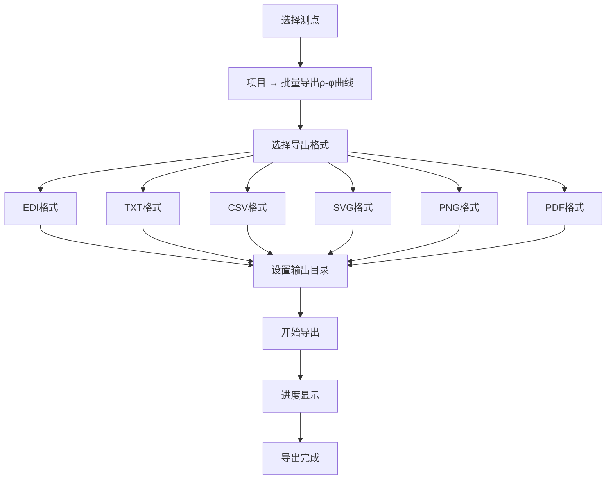
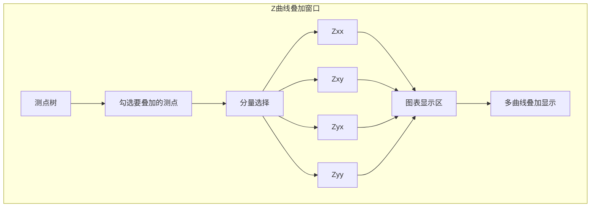

# 批量导出与工具

本章介绍 RMTDataPro 的批量导出功能、多测点叠加工具和其他实用功能。

## 📤 批量导出 ρ-φ 曲线

批量导出是 RMTDataPro 的核心功能之一，可以一次性导出多个测点的 ρ-φ 数据。

### 导出流程



### 导出格式

| 格式 | 类型 | 说明 | 适用场景 |
|------|------|------|----------|
| **EDI** | 数据格式 | 标准MT数据交换格式 | 第三方软件导入 |
| **TXT** | 数据格式 | 文本格式，每行一条记录 | 人工查看 |
| **CSV** | 数据格式 | 逗号分隔值 | Excel/SPSS 分析 |
| **SVG** | 图片格式 | 矢量图形 | 出版、编辑 |
| **PNG** | 图片格式 | 位图格式 | 报告、网页 |
| **PDF** | 图片格式 | 便携文档 | 打印、归档 |

### TXT/CSV 格式列说明

| 列名 | 单位 | 说明 |
|------|------|------|
| freq | Hz | 频率 |
| rxy | Ωm | 阻抗电阻率 (xy分量) |
| pxy | ° | 阻抗相位 (xy分量) |
| ryx | Ωm | 阻抗电阻率 (yx分量) |
| pyx | ° | 阻抗相位 (yx分量) |
| rxy_err | Ωm | xy电阻率误差 |
| pxy_err | ° | xy相位误差 |
| ryx_err | Ωm | yx电阻率误差 |
| pyx_err | ° | yx相位误差 |

### EDI 格式

EDI（Electrical Data Interchange）是 MT 数据的标准交换格式，包含测点信息、阻抗数据等。

### 导出对话框

批量导出对话框选项：

| 选项 | 说明 |
|------|------|
| **输出目录** | 选择导出文件保存位置 |
| **文件前缀** | 导出文件名前缀 |
| **频段选择** | 选择要导出的频段（D1-D4） |
| **频率范围** | 过滤特定频率范围 |
| **覆盖确认** | 已存在文件是否覆盖 |

## 📊 Z 曲线多测点叠加

Z 曲线叠加功能用于对比分析多个测点的阻抗响应。

### 界面布局



### 使用步骤

1. 切换到 **Z曲线多测点叠加** 标签页
2. 在左侧测点树中勾选要叠加的测点
3. 选择要显示的分量（Zxx, Zxy, Zyx, Zyy）
4. 选择数据类型（视电阻率/相位）
5. 图表自动更新显示叠加曲线

### 图表交互

| 操作 | 功能 |
|------|------|
| **鼠标滚轮** | 缩放 |
| **拖拽** | 平移 |
| **右键菜单** | 保存图片、复制数据 |

## 🎨 样式设置

### 图表样式

通过 **设置 → 样式设置** 自定义图表外观：

| 设置项 | 选项 |
|--------|------|
| **背景色** | 白色/浅灰/深灰 |
| **网格线** | 显示/隐藏、颜色 |
| **字体** | 字体、大小 |
| **曲线粗细** | 1-5px |

### 图表系列设置

通过 **设置 → 图表系列设置** 自定义每条曲线的样式：

| 属性 | 说明 |
|------|------|
| **颜色** | 曲线颜色 |
| **线型** | 实线/虚线/点线 |
| **标记** | 圆形/方形/三角 |
| **标记大小** | 1-10px |

## 🌐 多语言支持

RMTDataPro 支持中文和英文界面。

### 切换语言

通过 **设置 → 语言** 菜单切换：

- **Chinese**: 中文界面
- **English**: 英文界面

### 翻译文件

语言切换通过 Qt 翻译文件实现：

```
RMTDataPro_zh_CN.qm  # 中文翻译
RMTDataPro_en_US.qm  # 英文翻译
```

## 🛠️ 工具菜单

### 关于对话框

通过 **工具 → 关于** 打开关于对话框，显示：

- 软件名称和版本
- 版权信息
- 许可证
- 链接信息

## 📋 快捷键参考

| 快捷键 | 功能 |
|--------|------|
| Ctrl+Shift+N | 新建工程 (New Project) |
| Ctrl+Shift+O | 打开工程 (Open Project) |
| Ctrl+Shift+R | 最近工程 (Recent Projects) |
| Ctrl+Shift+S | 保存工程 (Save Project) |
| Ctrl+Alt+Shift+S | 另存工程 (Save Project As) |
| Ctrl+Shift+W | 关闭工程 (Close Project) |
| Ctrl+Shift+E | 批量导出 ρ-φ (Batch Export) |
| Ctrl+Alt+Shift+F | FFT 参数 (FFT Parameters) |
| Ctrl+Alt+Shift+C | 校准 (Calibration) |
| Ctrl+Alt+T | 样式设置 (Style Settings) |
| Ctrl+Alt+S | 图表系列设置 (Chart Series Settings) |
| Ctrl+Alt+Shift+X | 退出 (Exit) |
| F1 | 关于 (About) |

---

**下一节**: [实例展示](../gallery/index)
