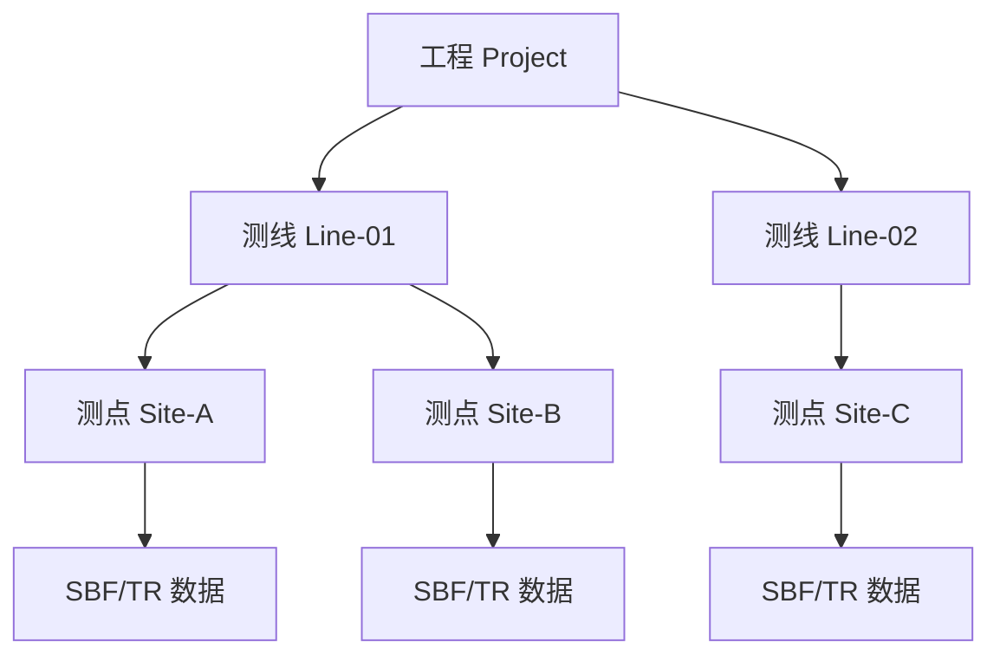

# 数据导入

本章介绍如何将外业采集的 RMT 数据导入 RMTDataPro 工程，包括 SBF 格式和 TR 格式数据的导入方法。

## 📂 数据格式简介

RMTDataPro 支持两种常用的数据格式：

### SBF 格式（时间序列格式）

SBF（Station Binary Format）是俄罗斯 SM25M/L 仪器采集的原始时间序列数据格式，二进制格式，文件体积较大。

**特点**：
- 二进制格式，文件体积较大（原始时间序列）
- 来自俄罗斯 SM25M/L 仪器
- 支持多频段（D1/D2/D3/D4）

**支持的频段**：

| 频段 | 采样率 | 频率范围 | 典型应用 |
|------|--------|----------|----------|
| **D1** | 39 kHz | 1-15000 Hz | 深部地质探测 |
| **D2** | 312 kHz | 50k-130k Hz | 中等深度 |
| **D3** | 832 kHz | 100k-350k Hz | 浅部勘探 |
| **D4-1248** | 1248 kHz | 300k-500k Hz | 近地表/工程探测 |
| **D4-2496** | 2496 kHz | 500k-1000k Hz | 近地表/工程探测 |

### TR 格式（频谱格式）

TR 格式是预先计算的频谱数据格式，包含已完成的 FFT 频谱信息。

**特点**：
- 文本或二进制格式
- 已包含 FFT 频谱数据
- 无需再进行频谱计算

**TR 格式支持的频段**：

| 频段 | 采样率 | 频率范围 | 典型应用 |
|------|--------|----------|----------|
| **T1** | 40 kHz | 1-16000 Hz | 深部地质探测 |
| **T2** | 400 kHz | 50k-160k Hz | 中等深度 |
| **T3** | 4000 kHz | 500k-1600k Hz | 浅部勘探 |

## 📥 数据导入操作

### SBF 文件导入

#### 通过菜单导入

1. 选择 **项目** → **新建工程**（或打开已有工程）
2. 在工程管理面板中，选中目标测线
3. 右键点击 → **导入 SBF 文件**
4. 在文件对话框中选择要导入的 SBF 文件
5. 点击"打开"确认导入

#### 通过拖拽导入

1. 打开工程并选中目标测线
2. 直接将 SBF 文件拖拽到工程管理面板
3. 软件自动识别并导入文件

### TR 文件导入

TR 格式文件的导入流程与 SBF 类似：

1. 选择 **项目** → **打开工程**
2. 选中目标测线
3. 右键 → **导入 TR 文件**
4. 选择 TR 格式文件并确认

> **注意**：SBF 格式为原始时间序列数据，导入后需要在 FFT 处理阶段进行频谱计算。

## 🗂️ 工程管理

### 创建测线

1. 在工程管理面板中右键点击工程节点
2. 选择 **新建测线**
3. 输入测线名称
4. 测线创建完成

### 创建测点

1. 右键点击测线节点
2. 选择 **新建测点**
3. 输入测点名称
4. 测点创建完成，可以导入数据

### 组织结构

## ❓ 常见问题

| 问题 | 原因 | 解决方法 |
|------|------|----------|
| 无法导入文件 | 文件格式不正确或损坏 | 确认文件格式，验证完整性 |
| 频段显示缺失 | 采集时未启用该频段 | 检查设备配置或使用其他数据文件 |
| 拖拽导入无效 | 未选中测线节点 | 先选中目标测线，再拖拽文件 |
| 导入速度慢 | 文件过大或数量过多 | 等待或分批导入 |

---

**下一节**: [FFT处理](fft-processing)

**上一节**: [RMT原理](chapter_rmt_theory)
