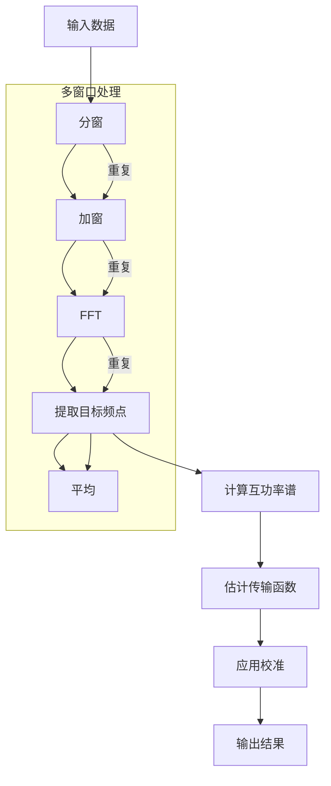

# FFT 处理

本章详细介绍 RMTDataPro 中的 FFT 处理功能和参数配置。

## ⚙️ FFT 参数配置

FFT 参数是影响处理质量的关键配置。通过 **设置 → FFT 参数** 菜单打开配置对话框。

### 基础参数

| 参数 | 说明 | 取值范围 | 默认值 |
|------|------|----------|--------|
| **窗口长度** | FFT 窗口的点数 | 4096, 8192, 16384, 32768, 65536, 131072, 262144 | 4096 |
| **重叠率** | 窗口重叠比例 | 0.0-0.99 | 0.5 |
| **窗口模式** | 单窗口/多窗口分析 | - | 单窗口 (Single) |
| **窗口类型** | 窗函数类型 | Rectangular/Hanning/Hamming/Blackman/Kaiser | Hanning |

### 时窗长度

时窗长度决定了频率分辨率：

| 采样率 | 窗口长度 | 频率分辨率 |
|--------|----------|------------|
| 39 kHz | 512 | 76.2 Hz |
| 39 kHz | 1024 | 38.1 Hz |
| 312 kHz | 512 | 609.4 Hz |

### 重叠率

重叠率影响统计稳定性：

- **低重叠率 (0.25-0.5)**: 计算快，统计样本少
- **中等重叠率 (0.5-0.75)**: 平衡速度和稳定性
- **高重叠率 (0.75-0.9)**: 统计样本多，计算慢

## 🪟 窗口模式

### 单窗口模式

使用单个窗口进行 FFT 分析，适用于数据量较少或噪声较低的情况。

**特点**：
- 计算速度快
- 适合简单数据分析

### 多窗口模式（MTSM）

多窗口谱分析（Multiple Taper Spectral Method）使用多个正交窗口（锥度）来减少频谱泄漏，提高统计稳定性。

**推荐配置**：

| 时间带宽积 NW | 窗口数 K | 频率分辨率 | 统计稳定性 |
|--------------|----------|------------|------------|
| 2.0 | 3 | 中等 | 良好 |
| 2.5 | 3 | 较高 | 很好 |
| 3.0 | 5 | 高 | 优秀 |
| 4.0 | 7 | 最高 | 最优 |

**参数选择原则**:
- NW 越大，频率分辨率越高
- $K \approx 2NW - 1$
- 噪声较大时选择更大的 NW

## 📊 目标频率配置

每个频段可以设置独立的目标频率列表：

| 频段 | 采样率 | 可选目标频率 |
|------|--------|--------------|
| D1 | 39 kHz | 100, 200, 500, 1000 Hz |
| D2 | 312 kHz | 5000, 10000, 20000 Hz |
| D3 | 832 kHz | 50000, 100000, 200000 Hz |
| D4-1248 | 1248 kHz | 200000, 500000 Hz |
| D4-2496 | 2496 kHz | 500000, 1000000 Hz |

### 频率带宽

频率提取带宽用于指定从 FFT 结果中提取目标频率时考虑的频率范围：

| 带宽设置 | 含义 |
|----------|------|
| 1 | 仅中心频点 |
| 3 | 中心频点 ± 左右各1个bin |
| 5 | 中心频点 ± 左右各2个bin |

## 🔢 阻抗估计类型

### 张量阻抗

张量阻抗同时利用水平和垂直磁场进行阻抗估计。

**适用场景**：
- 三维地质结构
- 需要完整阻抗张量
- 极化分析

### 标量阻抗

标量阻抗只使用水平磁场分量。

**适用场景**：
- 一维/二维地质结构
- 快速处理
- 噪声较大数据

## 📈 数据类型与频段启用

RMTDataPro 支持两种数据类型，每种类型有不同的频段配置：

### SBF 数据类型

SBF 数据有 5 个频段：

| 频段 | 采样率 | 频率范围 | 说明 |
|------|--------|----------|------|
| D1 | 39 kHz | 1-15000 Hz | 低频段，深部探测 |
| D2 | 312 kHz | 50k-130k Hz | 中频段 |
| D3 | 832 kHz | 100k-350k Hz | 高频段 |
| D4-1248 | 1248 kHz | 300k-500k Hz | 超高频段 |
| D4-2496 | 2496 kHz | 500k-1000k Hz | 超高频段，浅部探测 |

### TR 数据类型

TR 数据有 3 个频段：

| 频段 | 采样率 | 频率范围 | 说明 |
|------|--------|----------|------|
| T1 | 40 kHz | 1-16000 Hz | 低频段 |
| T2 | 400 kHz | 50k-160k Hz | 中频段 |
| T3 | 4000 kHz | 500k-1600k Hz | 高频段 |

## 🔧 处理流程

## 💾 参数文件

FFT 参数可以保存为 JSON 文件供下次使用。

**保存/加载**：
- 通过界面菜单保存当前配置
- 重新打开时加载已保存的配置

---

**下一节**: [数据处理](processing-workflow)
