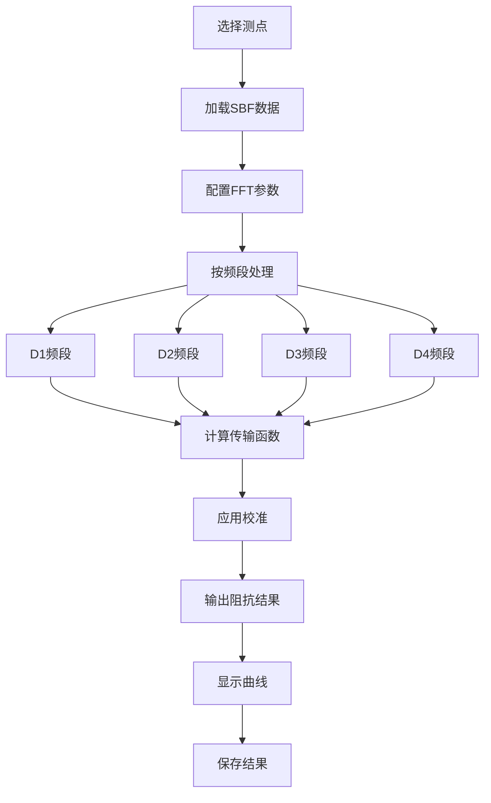
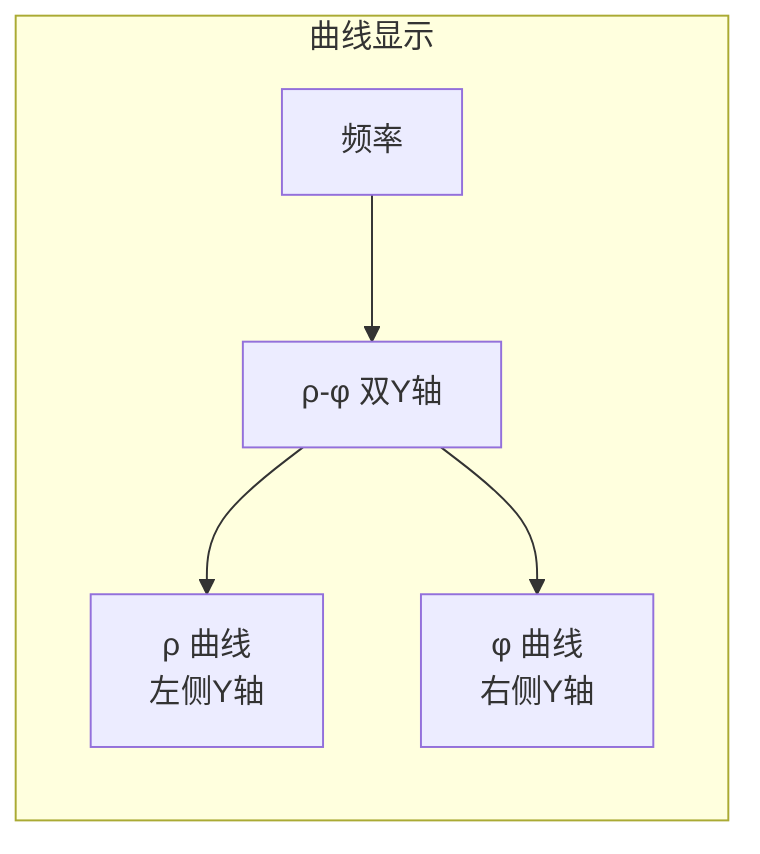

# 数据处理

本章介绍 RMTDataPro 中的数据处理流程、进度监控和结果评估。

## 🔄 处理流程

数据处理是将 SBF 频谱数据转换为可用阻抗结果的核心步骤：



## 📊 处理步骤详解

### 1. 测点选择

在测点列表中选择要处理的测点：

- **单点处理**: 选择单个测点，右键 → 处理
- **批量处理**: 选择多个测点（Ctrl/Shift 多选），右键 → 批量处理

### 2. 数据加载


### 3. 频段处理

每个频段独立处理：

| 频段 | 采样率 | 窗口数 | 处理时间（估计） |
|------|--------|--------|------------------|
| D1 | 39 kHz | 较多 | 较长 |
| D2 | 312 kHz | 中等 | 中等 |
| D3 | 832 kHz | 较少 | 较短 |
| D4 | 2496 kHz | 最少 | 最短 |

### 4. 结果输出

处理完成后自动：

- 计算视电阻率（ρ）和相位（φ）
- 计算误差估计
- 存储到结果对象

## 📈 进度监控

处理过程中，软件提供实时进度反馈：

### 进度条

主进度条显示整体完成百分比：

```
████████████████████░░░░ 80%
```

### 详细进度

详细信息显示当前处理的窗口：

```
处理中: D2 频段
窗口: 45 / 120
采样率: 312 kHz
```

## 📉 结果可视化

### ρ-φ 曲线

结果显示窗口显示视电阻率和相位随频率变化的曲线：



### 数据表格

同时显示详细数值：

| 频率 (Hz) | ρxx | ρxy | φxx | φxy | 误差 |
|-----------|-----|-----|-----|-----|------|
| 100 | 10.5 | 45.2 | -15° | 72° | 0.05 |
| 200 | 12.3 | 48.1 | -12° | 68° | 0.04 |

## ✔️ 质量评估

### ρ-φ 曲线连续性评估

数据质量通过检查 **视电阻率-相位曲线连续性** 来判断：

| 曲线特征 | 质量评估 | 建议 |
|----------|----------|------|
| 曲线光滑，无明显跳点 | ✅ 优质 | 可直接使用 |
| 轻微抖动，偶发跳点 | ⚠️ 可用 | 谨慎解释 |
| 明显跳点或曲线断裂 | ❌ 问题 | 需检查原因 |

### 误差估计

处理结果包含误差估计：

- **标准误差**: 单频点多次估计的离散程度
- **相对误差**: 相对于阻抗幅值的百分比

## 🛑 取消与中断

### 取消处理

在处理过程中可以取消：

- 点击取消按钮停止当前处理
- 已完成的频段结果会保留

### 处理中断点

- 频段边界可以安全中断
- 从断点恢复需要重新处理该频段

## 📤 结果保存

处理结果自动关联到测点，可随时查看和导出。

---

**下一节**: [批量导出与工具](data-export)
