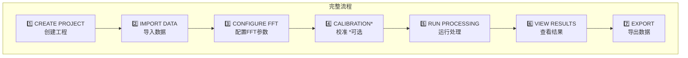
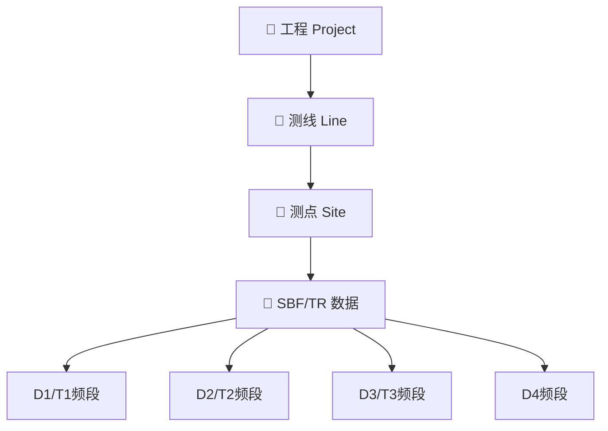
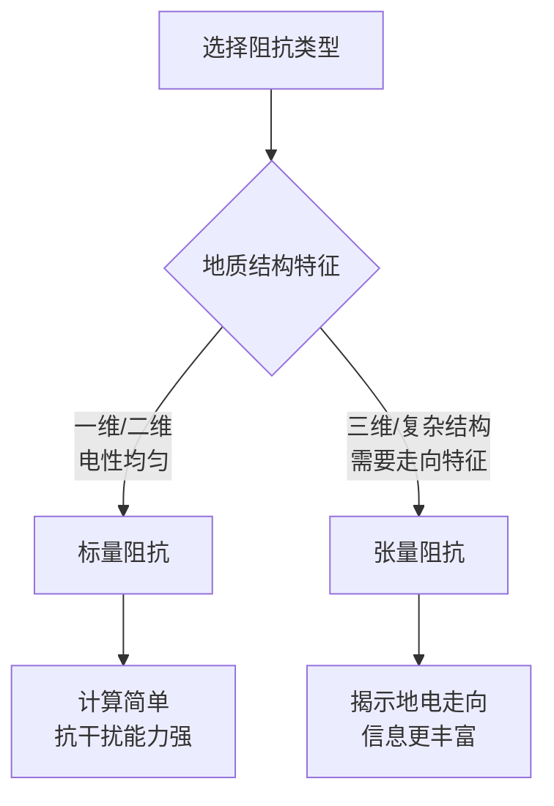
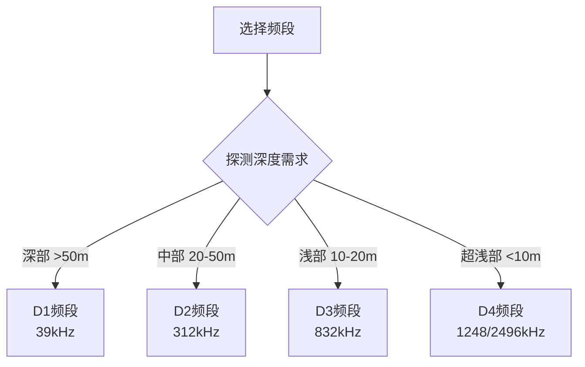
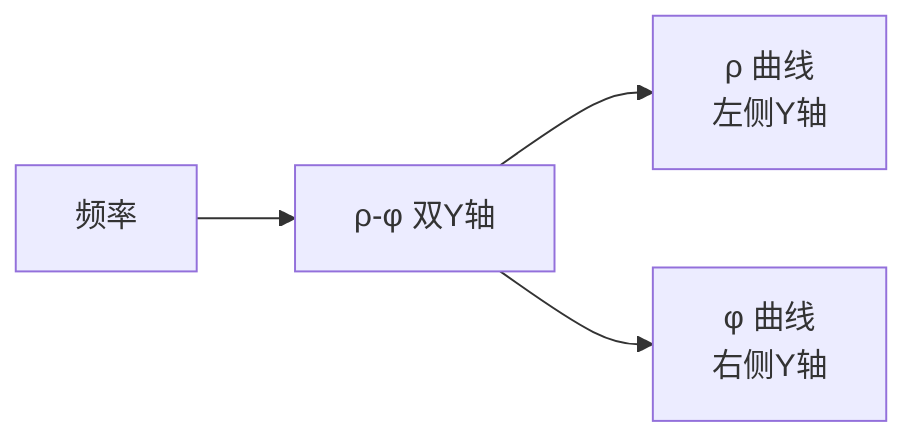
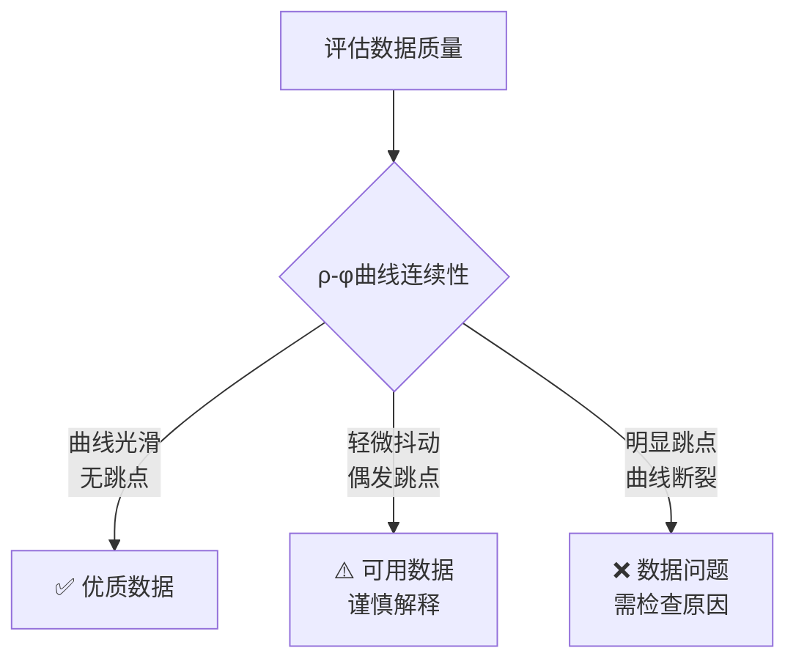
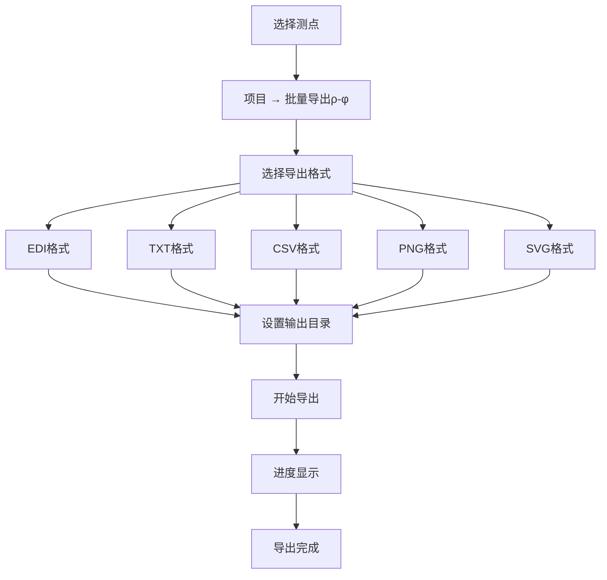
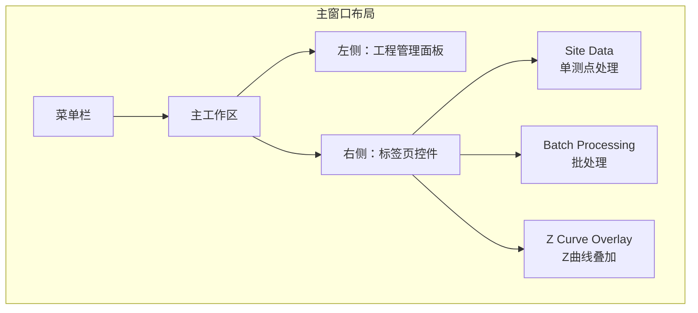

# 用户操作指南

本章介绍 RMTDataPro 的完整操作流程，按照7个步骤组织。

## 🔄 完整工作流程

> **\*** 校准步骤为可选，仅在有校准需求时执行

---

## 1️⃣ CREATE PROJECT - 创建工程

### 操作步骤

1. 启动 RMTDataPro 软件
2. 选择 **项目** → **新建工程** 
3. 选择工程保存位置
4. 输入工程名称
5. 点击 **确定**

### 菜单路径

| 操作 | 菜单路径 | 快捷键 |
|------|----------|--------|
| 新建工程 | 项目 → 新建工程 | Ctrl+Shift+N |
| 打开工程 | 项目 → 打开工程 | Ctrl+Shift+O |
| 最近工程 | 项目 → 最近工程 | Ctrl+Shift+R |
| 保存工程 | 项目 → 保存工程 | Ctrl+Shift+S |
| 另存为 | 项目 → 另存为 | Ctrl+Alt+Shift+S |
| 关闭工程 | 项目 → 关闭工程 | Ctrl+Shift+W |

### 工程文件

- 工程文件格式：`.rmtproj`
- 包含测线、测点、数据引用等信息

---

## 2️⃣ IMPORT DATA - 导入数据

### 支持的数据格式

RMTDataPro 支持两种数据格式：

#### SBF 格式（频谱格式）

| 频段 | 采样率 | 频率范围 | 典型应用 |
|------|--------|----------|----------|
| **D1** | 39 kHz | 1-15000 Hz | 深部探测 |
| **D2** | 312 kHz | 50k-130k Hz | 中等深度 |
| **D3** | 832 kHz | 100k-350k Hz | 浅部勘探 |
| **D4-1248** | 1248 kHz | 300k-500k Hz | 超浅部探测 |
| **D4-2496** | 2496 kHz | 500k-1000k Hz | 近地表/工程探测 |

#### TR 格式（自研设备时间序列格式）

| 频段 | 采样率 | 频率范围 | 典型应用 |
|------|--------|----------|----------|
| **T1** | 40 kHz | 1-16000 Hz | 深部探测 |
| **T2** | 400 kHz | 50k-160k Hz | 中等深度 |
| **T3** | 4000 kHz | 500k-1600k Hz | 浅部勘探 |

### 数据层级结构

### 导入方式

#### SBF 文件导入

1. 在工程面板中，选中目标测线
2. 右键点击 → **导入 SBF 文件**
3. 选择要导入的 SBF 文件
4. 点击"打开"确认

#### TR 文件导入

1. 在工程面板中，选中目标测线
2. 右键点击 → **导入 TR 文件**
3. 选择要导入的 TR* 文件
4. 点击"打开"确认

> **提示**: 支持批量导入多个文件，可按住 Ctrl 键多选。支持拖拽导入。

---

## 3️⃣ CONFIGURE FFT - 配置 FFT 参数

### 菜单路径

| 配置项 | 菜单路径 | 快捷键 |
|--------|----------|--------|
| FFT 参数 | 设置 → FFT 参数 | Ctrl+Alt+Shift+F |
| 校准管理 | 设置 → 校准 | Ctrl+Alt+Shift+C |

### FFT 参数配置

| 参数 | 说明 | 默认值 |
|------|------|--------|
| **窗口长度** | FFT 窗口的点数 | 4096 |
| **重叠率** | 窗口重叠比例 (0.0-0.99) | 0.5 |
| **窗口模式** | 单窗口/多窗口分析 | 单窗口 |
| **阻抗类型** | 标量/张量阻抗 | 张量阻抗 |

### 阻抗类型选择决策树

### 频段选择决策树

---

## 4️⃣ CALIBRATION (OPTIONAL) - 校准

### 何时需要校准

- 系统更换或维修后
- 定期校准检查
- 数据质量异常时

### 校准流程

1. 选择 **设置** → **校准**
2. 选择对应的校准文件
3. 验证校准参数
4. 确认应用到后续处理

### 校准功能

| 功能 | 说明 |
|------|------|
| 校准参数加载 | 自动加载系统校准文件 |
| 校准验证 | 检查校准文件的有效期和完整性 |
| 校准应用 | 处理时自动应用校准参数 |

---

## 5️⃣ RUN PROCESSING - 运行处理

### 处理方式

#### 单测点处理

1. 在工程管理面板选择要处理的测点
2. 右键点击 → **处理** 或点击处理按钮
3. 观察处理进度

#### 批量处理

1. 在测点列表中选择多个测点（Ctrl/Shift 多选）
2. 右键点击 → **批量处理**
3. 设置处理参数
4. 点击"开始处理"

### 处理状态监控

| 状态 | 含义 |
|------|------|
| 等待中 | 任务排队等待处理 |
| 处理中 | 正在执行 FFT 处理 |
| 已完成 | 处理成功完成 |
| 失败 | 处理过程中出现错误 |

---

## 6️⃣ VIEW RESULTS - 查看结果

### 结果显示区域

软件主界面分为左右两部分：

- **左侧面板**: 工程管理（测线、测点树形结构）
- **右侧标签页**: 三个工作标签页

| 标签页 | 用途 |
|--------|------|
| Site Data | 单测点数据处理和结果显示 |
| Batch Processing | 多测点批量并行处理 |
| Z Curve Overlay | 多测点 Z 曲线叠加对比分析 |

### ρ-φ 曲线

结果显示窗口显示视电阻率和相位随频率变化的曲线：

### 数据质量评估决策树

### 质量评估标准

通过 **ρ-φ 曲线连续性** 判断数据质量：

| 曲线特征 | 质量判断 |
|----------|----------|
| 曲线光滑，无明显跳点 | ✅ 优质 |
| 轻微抖动，偶发跳点 | ⚠️ 可用但需谨慎 |
| 明显跳点或曲线断裂 | ❌ 需检查原因 |

---

## 7️⃣ EXPORT - 导出数据

### 导出格式

| 格式 | 类型 | 适用场景 |
|------|------|----------|
| **EDI** | 数据格式 | 标准 MT 数据交换格式，第三方软件导入 |
| **TXT** | 数据格式 | 文本格式，人工查看 |
| **CSV** | 数据格式 | Excel/SPSS 分析 |
| **PNG** | 图片格式 | 报告、网页 |
| **SVG** | 图片格式 | 矢量图形，出版、编辑 |
| **PDF** | 图片格式 | 打印、归档 |

### 导出流程

### 菜单路径

| 操作 | 菜单路径 | 快捷键 |
|------|----------|--------|
| 批量导出 ρ-φ | 项目 → 批量导出 | Ctrl+Shift+E |

---

## 📊 主界面布局总览

### 菜单功能总览

| 菜单 | 功能 | 快捷键 |
|------|------|--------|
| **项目** | 新建、打开、保存、关闭工程、批量导出 | |
| **工具** | About 关于 | F1 |
| **设置** | FFT 参数、校准、样式设置、图表系列设置、语言 | |

---

**下一节**: [RMT原理](chapter_rmt_theory)
