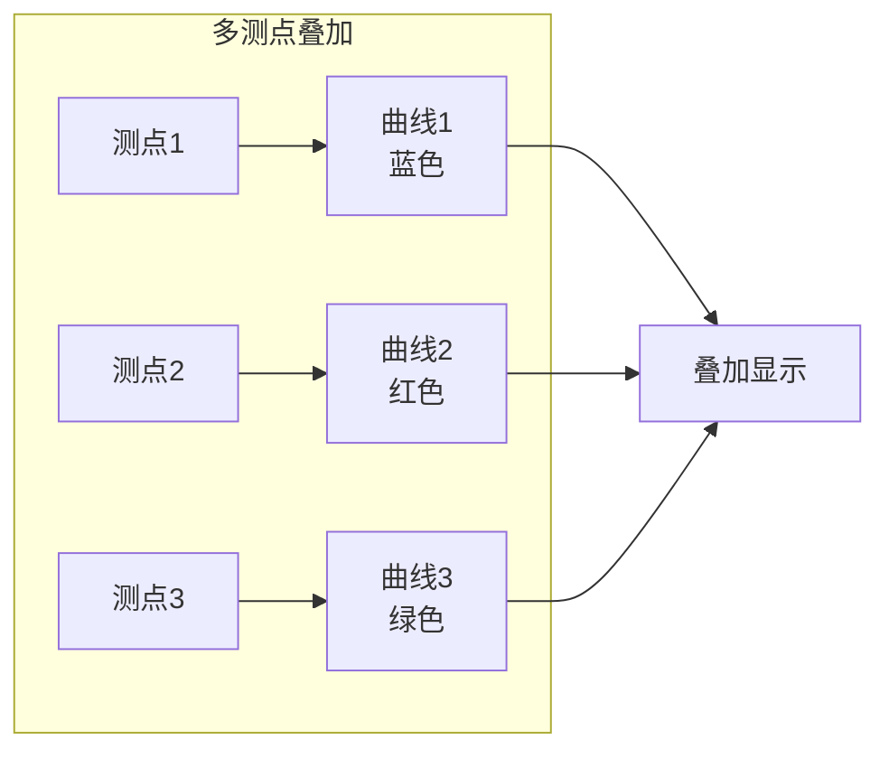

# 实例展示

本页面展示 RMTDataPro 的典型应用实例和处理效果。

## 📊 典型应用场景

### 1. 地质勘探

RMT 技术广泛应用于各类地质勘探项目：

- **区域地质调查**: 大范围地质结构普查
- **矿产资源勘探**: 矿体定位与评价
- **水文地质调查**: 含水层分布研究
- **工程地质勘察**: 隧道、坝基等工程地质评价

### 2. 环境调查

- **污染源探测**: 地下水污染调查
- **垃圾填埋场调查**: 渗漏检测
- **湿地研究**: 沉积层分析

## 🖼️ 处理效果示例

### 单测点 ρ-φ 曲线

典型的一维地质模型 ρ-φ 曲线：

| 频率范围 | 曲线特征 | 地质解释 |
|----------|----------|----------|
| 高频 (>100kHz) | 低电阻率 | 近地表高含水量 |
| 中频 (10-100kHz) | 过渡区 | 风化层 |
| 低频 (<10kHz) | 高电阻率 | 基岩 |

### 多测点叠加对比

Z 曲线叠加功能展示多个测点的对比：

## 📈 数据质量示例

### 优质数据特征

- 相干度高 (>0.8)
- 曲线光滑
- 误差小
- 重复性好

### 数据质量问题

| 问题类型 | 表现 | 处理建议 |
|----------|------|----------|
| 电磁噪声 | 高频抖动 | 增加叠加次数 |
| 人文干扰 | 50/100Hz 谐波 | 滤波处理 |
| 设备故障 | 数据缺失 | 检查校准 |
| 信号弱 | 误差大 | 延长采集时间 |

## 🔗 相关教程

- [Python 绘图教程](../tutorial/plotting)

## 📚 更多资源

- [参数说明参考](../appendices/appendixC)
- [常见问题解答](../appendices/appendixD)
