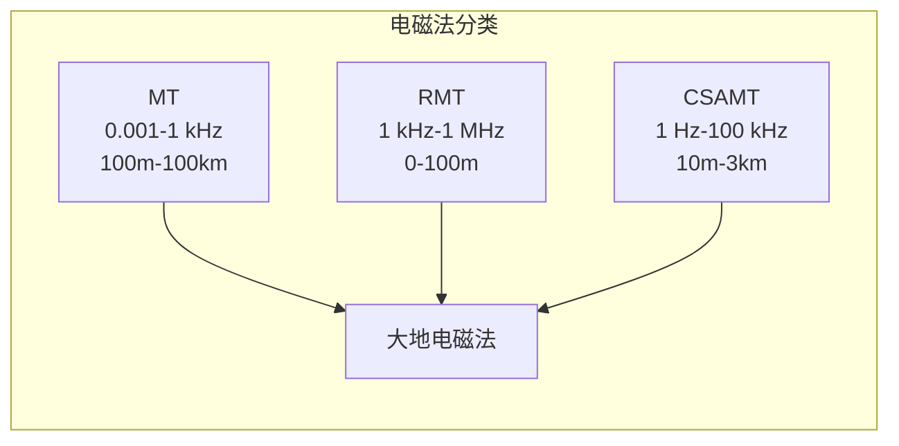
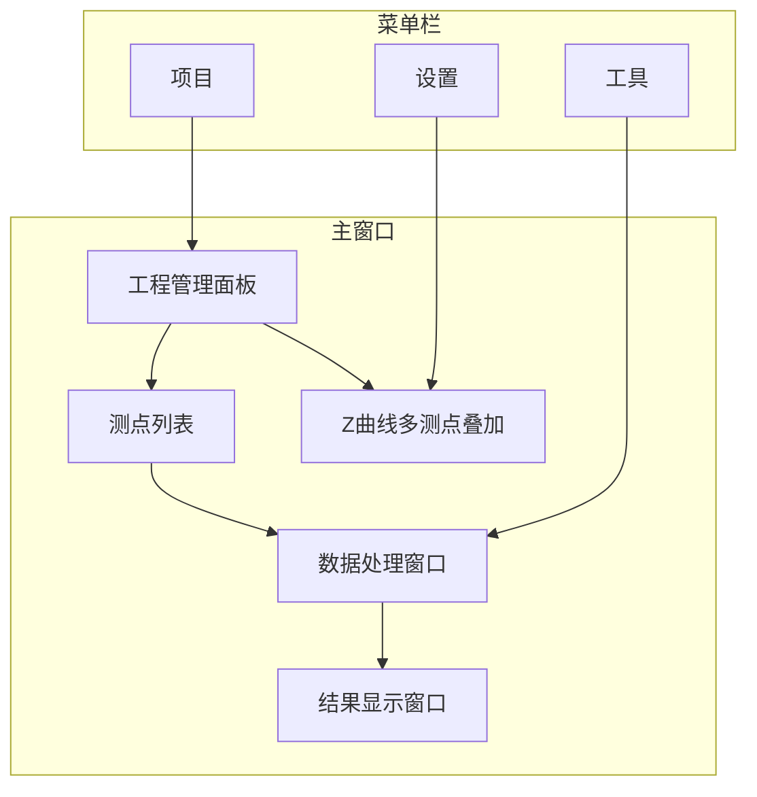

# 软件简介

RMTDataPro 是一款专业的 **射频大地电磁法（Radio Magnetotellurics, RMT）** 数据处理软件。

## 什么是 RMT？

RMT（射频大地电磁法，Radio Magnetotellurics）是一种被动源电磁探测技术，通过采集高频段（1 kHz – 1 MHz）的天然电磁场信号来研究浅层地下电性结构。

### 技术参数

| 参数 | 数值 | 说明 |
|------|------|------|
| **频率范围** | 1 kHz – 1 MHz | 典型工作频段 10-250 kHz |
| **探测深度** | 0-100 米 | 取决于频率和地层电阻率 |
| **信号来源** | 天然电磁场 | VLF发射台、无线电、电力线 |
| **分辨率** | 高 | 适用于浅层目标探测 |

### RMT 与其他电磁方法

### 基本原理

RMT 方法基于以下物理原理：

1. **天然电磁场**: 地球天然存在宽频带的电磁场信号
2. **趋肤效应**: 高频信号主要反映浅层电性结构
3. **阻抗响应**: 地下电性结构对电磁场的响应可用阻抗表征

> **核心公式**: 视电阻率 $\rho_a = \frac{|Z|^2}{\omega\mu}$，其中 $Z = E/H$ 为阻抗

## 主要功能

### 1. 📂 项目管理
- 创建、打开、保存工程
- 测线与测点层级管理
- 最近工程快速访问

### 2. 📊 SBF 数据支持
- 支持 SBF（Station Binary Format）格式读取
- 多频段支持：D1（39kHz）、D2（312kHz）、D3（832kHz）、D4（2496kHz）
- 自动识别频段与采样率

### 3. ⚙️ FFT 参数配置
- 可配置窗口长度、重叠率
- 支持单窗口与多窗口（MTSM）分析
- 张量/标量阻抗估计模式

### 4. 📈 结果可视化
- ρ-φ 曲线显示
- 多测点曲线叠加对比
- 自定义图表样式

### 5. 📤 批量导出
- 批量导出 ρ-φ 曲线
- EDI 格式支持
- 灵活的数据输出选项

### 6. 🔧 校准功能
- 系统响应校准
- 校准参数管理

### 7. 🌍 多语言支持
- 中文界面
- 英文界面

## 系统界面

## 操作流程

RMTDataPro 的标准操作流程如下：

### 各步骤说明

| 步骤 | 功能 | 说明 |
|------|------|------|
| **数据导入** | 导入 SBF 格式频谱数据 | 支持 D1-D4 四个频段 |
| **标定管理** |管理系统校准参数 | 确保数据准确性 |
| **FFT参数配置** | 设置处理参数 | 窗口、重叠、阻抗类型等 |
| **FFT处理** | 执行频谱到阻抗的转换 | 使用 Gamble 方法 |
| **结果导出** | 导出处理结果 | 支持 EDI、文本等格式 |

## 版本信息

**当前版本**: v0.1.0  
**发布日期**: 2026年3月

## RMT 方法背景

RMT 方法是从传统大地电磁法（MT）发展而来的高频变种，主要区别在于：

- **更高的频率范围**：RMT 使用 1 kHz – 1 MHz 频段，而传统 MT 使用 0.001 Hz – 1 kHz
- **更浅的探测深度**：RMT 主要探测 0-100 米深度，MT 可探测数百公里
- **更轻便的设备**：由于高频信号衰减快，RMT 使用更轻量的传感器
- **更快的采集速度**：RMT 可实现每天 50-70 个测点的采集速度

RMT 方法在地下水勘探、工程地质、环境调查等领域有广泛应用。

## 技术架构

RMTDataPro 基于以下技术构建：

- **Qt 6.9+**: 跨平台 GUI 框架
- **Intel MKL 2024.2+**: 高性能数学运算
- **Eigen 3.4+**: 线性代数库
- **CMake 3.16+**: 构建系统

---

**下一节**: [安装指南](install)
