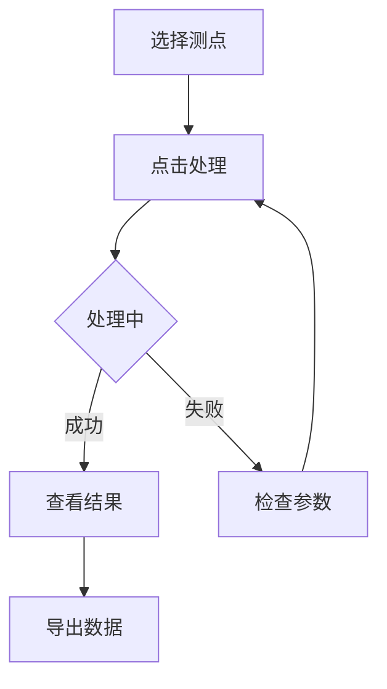
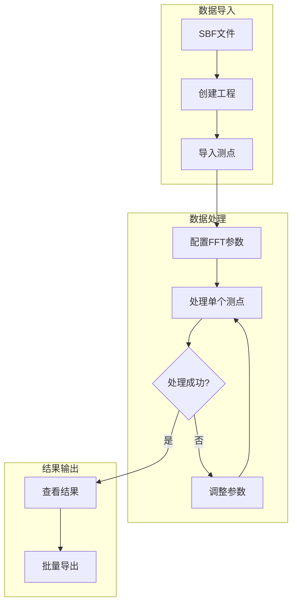

# 快速开始

本节将通过一个简单示例，帮助您在 10 分钟内完成第一次 RMT 数据处理。

## 📋 前提条件

在开始之前，请确保：

- ✅ RMTDataPro 已正确安装
- ✅ 有可用的 SBF 格式数据文件
- ✅ 软件可以正常启动

## 🚀 处理流程

### 第一步：创建工程

1. 启动 RMTDataPro
2. 点击菜单 **项目 → 新建工程**
3. 选择工程保存位置
4. 输入工程名称
5. 点击 **确定**

### 第二步：导入 SBF 数据

1. 在工程面板中，右键点击 **测点**
2. 选择 **导入 SBF 文件**
3. 浏览并选择 SBF 数据文件
4. 等待数据加载完成

> **提示**: 支持批量选择多个 SBF 文件同时导入。

### 第三步：配置 FFT 参数

1. 点击菜单 **设置 → FFT 参数**
2. 配置处理参数：

| 参数 | 说明 | 建议值 |
|------|------|--------|
| 窗口长度 | FFT 窗口点数 | 256-1024 |
| 重叠率 | 窗口重叠比例 | 0.5-0.75 |
| 窗口模式 | 单窗口/多窗口 | 多窗口(MTSM) |
| 阻抗类型 | 张量/标量 | 张量 |

3. 点击 **应用** 保存设置

### 第四步：处理测点

1. 在测点列表中选择要处理的测点
2. 点击 **处理** 按钮（或右键 → 处理）
3. 观察进度条，等待处理完成

### 第五步：查看结果

处理完成后，结果将显示在 **结果显示窗口** 中：

- **ρ-φ 曲线**: 视电阻率与相位随频率变化
- **数据表格**: 详细数值输出
- **质量指标**: 相干度、误差估计

### 第六步：导出数据

1. 选择要导出的测点
2. 点击菜单 **项目 → 批量导出 ρ-φ**
3. 选择导出格式（EDI/TXT/CSV）
4. 设置输出目录
5. 点击 **导出**

## 💡 高级功能

### Z 曲线多测点叠加

用于对比分析多个测点的数据：

1. 点击 **Z曲线多测点叠加** 标签页
2. 在测点树中选择要叠加的测点
3. 选择显示分量（Zxx, Zxy, Zyx, Zyy）
4. 查看叠加曲线

### 校准功能

1. 点击菜单 **设置 → 校准**
2. 加载校准文件
3. 应用校准参数到处理流程

## 📊 示例工作流

## 🆘 故障排除

| 问题 | 可能原因 | 解决方案 |
|------|----------|----------|
| 无法导入 SBF | 文件格式错误 | 确认是 SBF 格式 |
| 处理失败 | 参数配置不当 | 检查 FFT 参数 |
| 结果异常 | 数据质量问题 | 检查原始数据 |
| 导出失败 | 路径无权限 | 更换输出目录 |

## 📚 下一步

- 深入了解 [SBF 数据格式](../chapters/chapter2)
- 学习 [FFT 处理参数](../chapters/chapter3)
- 掌握 [批量导出功能](../chapters/chapter5)

---

**返回**: [软件简介](index)
