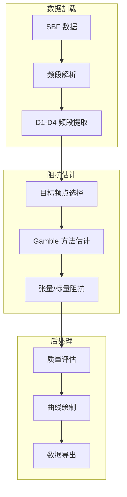

# 进阶教程

本章节包含 RMTDataPro 的进阶使用教程。

## 处理流程详解

典型的 RMT 数据处理流程包括以下环节：

## 学习路径

建议按以下顺序学习：

1. 掌握基本操作流程（快速入门）
2. 了解 SBF 数据格式结构
3. 理解 RMT 与 MT 的处理差异
4. 实践批量导出功能
5. 探索 Z 曲线叠加分析

## 专题教程

- [数据导出与绘图](plotting) - 批量导出 ρ-φ 数据并绑制曲线
